# Vernieuwing Softwarecatalogus
Snelle toegang tot de relevante view voor de vernieuwing van de Softwarecatalogus

Report generated at: 2025-03-11  08:29:27

---
## Inhoudsopgave

* [Pakket van Eisen aanbesteding](#pakket-van-eisen-aanbesteding)
  * [Softwarecatalogus Pakket van Eisen](#softwarecatalogus-pakket-van-eisen)
  * [Toegangsbeveiliging](#toegangsbeveiliging)
  * [Gebruik](#gebruik)
  * [Beheren content en configuratie](#beheren-content-en-configuratie)
  * [Aanbod](#aanbod)
  * [Organisatie](#organisatie)
  * [Referentiearchitectuur](#referentiearchitectuur)
  * [Management informatie](#management-informatie)
  * [Data-migratie](#data-migratie)
  * [Softwarecatalogus Non-functionals](#softwarecatalogus-non-functionals)
* [Realisatie en onderhoud](#realisatie-en-onderhoud)
  * [Softwarecatalogus gebruikers en eigenaren](#softwarecatalogus-gebruikers-en-eigenaren)
  * [Softwarecatalogus applicatiearchitectuur Referentiearchitectuur](#softwarecatalogus-applicatiearchitectuur-referentiearchitectuur)
  * [Softwarecatalogus applicatiearchitectuur](#softwarecatalogus-applicatiearchitectuur)
  * [Softwarecatalogus technische architectuur](#softwarecatalogus-technische-architectuur)
  * [Open Registers en -Connector technische architectuur](#open-registers-en-connector-technische-architectuur)
  * [DevOps en tools](#devops-en-tools)

---

## Pakket van Eisen aanbesteding

### Softwarecatalogus Pakket van Eisen

Overzicht van eisen en wensen voor vernieuwing Softwarecatalogus
<figure align="center">
  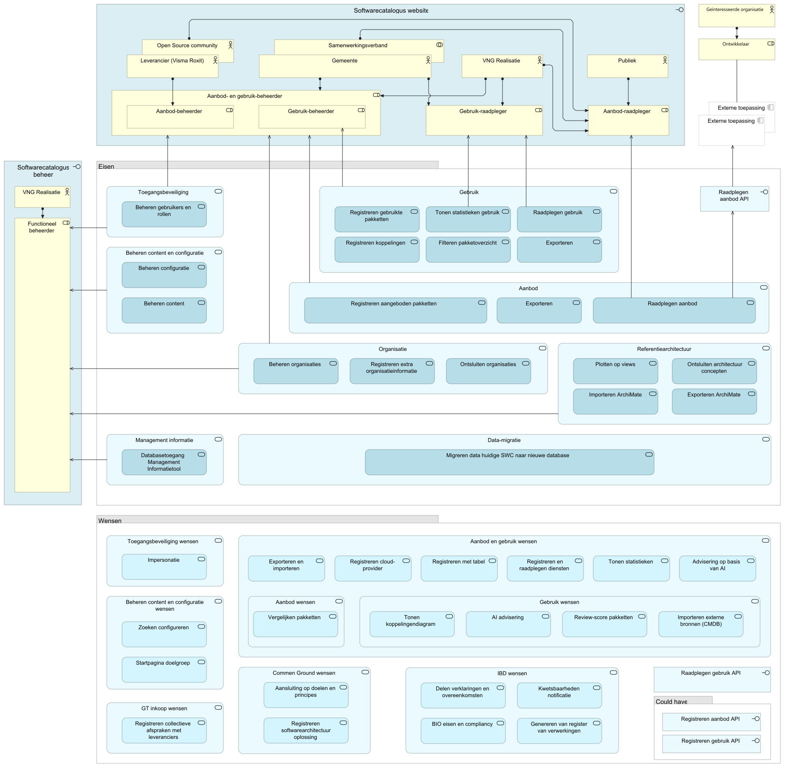
  <figcaption><i>Softwarecatalogus Pakket van Eisen</i></figcaption>
</figure>

<table>
  <thead>
    <tr>
      <th colspan="4" width="20%">Element</th>
      <th rowspan="2" width="80%">Documentation</th>
    </tr>
  </thead>
  <tbody>
    <tr><td></td><td></td><td></td><td></td><td></td></tr>
    <tr valign="top")>
      <td colspan="4">Softwarecatalogus website</td>
      <td></td>
    </tr>
    <tr valign="top")>
      <td colspan="1"></td>
      <td colspan="3">Leverancier (Visma Roxit)</td>
      <td>
Aanbieders van standaard-software(pakketten) voor gemeentelijke taken. Alleen leveranciers die het convenant met VNG/KING ondertekend hebben, mogen hun gegevens in de Softwarecatalogus zetten.
</td>
    </tr>
    <tr valign="top")>
      <td colspan="1"></td>
      <td colspan="3">Open Source community</td>
      <td></td>
    </tr>
    <tr valign="top")>
      <td colspan="1"></td>
      <td colspan="3">Gemeente</td>
      <td>
Een gemeente is een groep van woonkernen (dorpen, steden) met het bijbehorende gebied die samen worden bestuurd door een politiek apparaat.
</td>
    </tr>
    <tr valign="top")>
      <td colspan="1"></td>
      <td colspan="3">Samenwerkingsverband</td>
      <td>
Een samenwerking (of samenwerkingverband) is een juridische vorm waarin gemeenten vastleggen welke specifiek omschreven taken en bevoegdheden aan de samenwerking worden gedelegeerd.
</td>
    </tr>
    <tr valign="top")>
      <td colspan="1"></td>
      <td colspan="3">VNG Realisatie</td>
      <td></td>
    </tr>
    <tr valign="top")>
      <td colspan="1"></td>
      <td colspan="3">Publiek</td>
      <td></td>
    </tr>
    <tr valign="top")>
      <td colspan="1"></td>
      <td colspan="3">Aanbod- en gebruik-beheerder</td>
      <td></td>
    </tr>
    <tr valign="top")>
      <td colspan="2"></td>
      <td colspan="2">Aanbod-beheerder</td>
      <td></td>
    </tr>
    <tr valign="top")>
      <td colspan="2"></td>
      <td colspan="2">Gebruik-beheerder</td>
      <td></td>
    </tr>
    <tr valign="top")>
      <td colspan="1"></td>
      <td colspan="3">Gebruik-raadpleger</td>
      <td></td>
    </tr>
    <tr valign="top")>
      <td colspan="1"></td>
      <td colspan="3">Aanbod-raadpleger</td>
      <td></td>
    </tr>
    <tr valign="top")>
      <td colspan="4">Geïnteresseerde organisatie</td>
      <td></td>
    </tr>
    <tr valign="top")>
      <td colspan="4">Ontwikkelaar</td>
      <td></td>
    </tr>
    <tr valign="top")>
      <td colspan="4">Externe toepassing</td>
      <td></td>
    </tr>
    <tr valign="top")>
      <td colspan="4">Softwarecatalogus beheer</td>
      <td></td>
    </tr>
    <tr valign="top")>
      <td colspan="1"></td>
      <td colspan="3">VNG Realisatie</td>
      <td></td>
    </tr>
    <tr valign="top")>
      <td colspan="1"></td>
      <td colspan="3">Functioneel beheerder</td>
      <td></td>
    </tr>
    <tr valign="top")>
      <td colspan="4">Eisen</td>
      <td></td>
    </tr>
    <tr valign="top")>
      <td colspan="1"></td>
      <td colspan="3">Toegangsbeveiliging</td>
      <td></td>
    </tr>
    <tr valign="top")>
      <td colspan="2"></td>
      <td colspan="2">Beheren gebruikers en rollen</td>
      <td></td>
    </tr>
    <tr valign="top")>
      <td colspan="1"></td>
      <td colspan="3">Beheren content en configuratie</td>
      <td></td>
    </tr>
    <tr valign="top")>
      <td colspan="2"></td>
      <td colspan="2">Beheren configuratie</td>
      <td></td>
    </tr>
    <tr valign="top")>
      <td colspan="2"></td>
      <td colspan="2">Beheren content</td>
      <td></td>
    </tr>
    <tr valign="top")>
      <td colspan="1"></td>
      <td colspan="3">Gebruik</td>
      <td></td>
    </tr>
    <tr valign="top")>
      <td colspan="2"></td>
      <td colspan="2">Registreren gebruikte pakketten</td>
      <td></td>
    </tr>
    <tr valign="top")>
      <td colspan="2"></td>
      <td colspan="2">Tonen statistieken gebruik</td>
      <td></td>
    </tr>
    <tr valign="top")>
      <td colspan="2"></td>
      <td colspan="2">Raadplegen gebruik</td>
      <td></td>
    </tr>
    <tr valign="top")>
      <td colspan="2"></td>
      <td colspan="2">Registreren koppelingen</td>
      <td></td>
    </tr>
    <tr valign="top")>
      <td colspan="2"></td>
      <td colspan="2">Filteren pakketoverzicht</td>
      <td></td>
    </tr>
    <tr valign="top")>
      <td colspan="2"></td>
      <td colspan="2">Exporteren</td>
      <td></td>
    </tr>
    <tr valign="top")>
      <td colspan="1"></td>
      <td colspan="3">Raadplegen aanbod API</td>
      <td></td>
    </tr>
    <tr valign="top")>
      <td colspan="1"></td>
      <td colspan="3">Aanbod</td>
      <td></td>
    </tr>
    <tr valign="top")>
      <td colspan="2"></td>
      <td colspan="2">Registreren aangeboden pakketten</td>
      <td></td>
    </tr>
    <tr valign="top")>
      <td colspan="2"></td>
      <td colspan="2">Exporteren</td>
      <td></td>
    </tr>
    <tr valign="top")>
      <td colspan="2"></td>
      <td colspan="2">Raadplegen aanbod</td>
      <td></td>
    </tr>
    <tr valign="top")>
      <td colspan="1"></td>
      <td colspan="3">Organisatie</td>
      <td></td>
    </tr>
    <tr valign="top")>
      <td colspan="2"></td>
      <td colspan="2">Beheren organisaties</td>
      <td></td>
    </tr>
    <tr valign="top")>
      <td colspan="2"></td>
      <td colspan="2">Registreren extra organisatieinformatie</td>
      <td></td>
    </tr>
    <tr valign="top")>
      <td colspan="2"></td>
      <td colspan="2">Ontsluiten organisaties</td>
      <td></td>
    </tr>
    <tr valign="top")>
      <td colspan="1"></td>
      <td colspan="3">Referentiearchitectuur</td>
      <td></td>
    </tr>
    <tr valign="top")>
      <td colspan="2"></td>
      <td colspan="2">Plotten op views</td>
      <td></td>
    </tr>
    <tr valign="top")>
      <td colspan="2"></td>
      <td colspan="2">Ontsluiten architectuur concepten</td>
      <td></td>
    </tr>
    <tr valign="top")>
      <td colspan="2"></td>
      <td colspan="2">Importeren ArchiMate</td>
      <td></td>
    </tr>
    <tr valign="top")>
      <td colspan="2"></td>
      <td colspan="2">Exporteren ArchiMate</td>
      <td></td>
    </tr>
    <tr valign="top")>
      <td colspan="1"></td>
      <td colspan="3">Management informatie</td>
      <td></td>
    </tr>
    <tr valign="top")>
      <td colspan="2"></td>
      <td colspan="2">Databasetoegang Management Informatietool</td>
      <td></td>
    </tr>
    <tr valign="top")>
      <td colspan="1"></td>
      <td colspan="3">Data-migratie</td>
      <td></td>
    </tr>
    <tr valign="top")>
      <td colspan="2"></td>
      <td colspan="2">Migreren data huidige SWC naar nieuwe database</td>
      <td></td>
    </tr>
    <tr valign="top")>
      <td colspan="4">Wensen</td>
      <td></td>
    </tr>
    <tr valign="top")>
      <td colspan="1"></td>
      <td colspan="3">Toegangsbeveiliging wensen</td>
      <td></td>
    </tr>
    <tr valign="top")>
      <td colspan="2"></td>
      <td colspan="2">Impersonatie</td>
      <td></td>
    </tr>
    <tr valign="top")>
      <td colspan="1"></td>
      <td colspan="3">Beheren content en configuratie wensen</td>
      <td></td>
    </tr>
    <tr valign="top")>
      <td colspan="2"></td>
      <td colspan="2">Zoeken configureren</td>
      <td></td>
    </tr>
    <tr valign="top")>
      <td colspan="2"></td>
      <td colspan="2">Startpagina doelgroep</td>
      <td></td>
    </tr>
    <tr valign="top")>
      <td colspan="1"></td>
      <td colspan="3">Aanbod en gebruik wensen</td>
      <td></td>
    </tr>
    <tr valign="top")>
      <td colspan="2"></td>
      <td colspan="2">Exporteren en importeren</td>
      <td></td>
    </tr>
    <tr valign="top")>
      <td colspan="2"></td>
      <td colspan="2">Registreren cloud-provider</td>
      <td></td>
    </tr>
    <tr valign="top")>
      <td colspan="2"></td>
      <td colspan="2">Registreren met tabel</td>
      <td></td>
    </tr>
    <tr valign="top")>
      <td colspan="2"></td>
      <td colspan="2">Registreren en raadplegen diensten</td>
      <td></td>
    </tr>
    <tr valign="top")>
      <td colspan="2"></td>
      <td colspan="2">Tonen statistieken</td>
      <td></td>
    </tr>
    <tr valign="top")>
      <td colspan="2"></td>
      <td colspan="2">Advisering op basis van AI</td>
      <td></td>
    </tr>
    <tr valign="top")>
      <td colspan="2"></td>
      <td colspan="2">Aanbod wensen</td>
      <td></td>
    </tr>
    <tr valign="top")>
      <td colspan="3"></td>
      <td colspan="1">Vergelijken pakketten</td>
      <td></td>
    </tr>
    <tr valign="top")>
      <td colspan="2"></td>
      <td colspan="2">Gebruik wensen</td>
      <td></td>
    </tr>
    <tr valign="top")>
      <td colspan="3"></td>
      <td colspan="1">Tonen koppelingendiagram</td>
      <td></td>
    </tr>
    <tr valign="top")>
      <td colspan="3"></td>
      <td colspan="1">AI advisering</td>
      <td></td>
    </tr>
    <tr valign="top")>
      <td colspan="3"></td>
      <td colspan="1">Review-score pakketten</td>
      <td></td>
    </tr>
    <tr valign="top")>
      <td colspan="3"></td>
      <td colspan="1">Importeren externe bronnen (CMDB)</td>
      <td></td>
    </tr>
    <tr valign="top")>
      <td colspan="1"></td>
      <td colspan="3">Raadplegen gebruik API</td>
      <td></td>
    </tr>
    <tr valign="top")>
      <td colspan="1"></td>
      <td colspan="3">GT inkoop wensen</td>
      <td></td>
    </tr>
    <tr valign="top")>
      <td colspan="2"></td>
      <td colspan="2">Registreren collectieve afspraken met leveranciers</td>
      <td></td>
    </tr>
    <tr valign="top")>
      <td colspan="1"></td>
      <td colspan="3">Commen Ground wensen</td>
      <td></td>
    </tr>
    <tr valign="top")>
      <td colspan="2"></td>
      <td colspan="2">Aansluiting op doelen en principes</td>
      <td></td>
    </tr>
    <tr valign="top")>
      <td colspan="2"></td>
      <td colspan="2">Registreren softwarearchitectuur oplossing</td>
      <td></td>
    </tr>
    <tr valign="top")>
      <td colspan="1"></td>
      <td colspan="3">IBD wensen</td>
      <td></td>
    </tr>
    <tr valign="top")>
      <td colspan="2"></td>
      <td colspan="2">Delen verklaringen en overeenkomsten</td>
      <td></td>
    </tr>
    <tr valign="top")>
      <td colspan="2"></td>
      <td colspan="2">Kwetsbaarheden notificatie</td>
      <td></td>
    </tr>
    <tr valign="top")>
      <td colspan="2"></td>
      <td colspan="2">BIO eisen en compliancy</td>
      <td></td>
    </tr>
    <tr valign="top")>
      <td colspan="2"></td>
      <td colspan="2">Genereren van register van verwerkingen</td>
      <td></td>
    </tr>
    <tr valign="top")>
      <td colspan="1"></td>
      <td colspan="3">Could have</td>
      <td></td>
    </tr>
    <tr valign="top")>
      <td colspan="2"></td>
      <td colspan="2">Registreren aanbod API</td>
      <td></td>
    </tr>
    <tr valign="top")>
      <td colspan="2"></td>
      <td colspan="2">Registreren gebruik API</td>
      <td></td>
    </tr>
  </tbody>
</table>

### Toegangsbeveiliging

<figure align="center">
  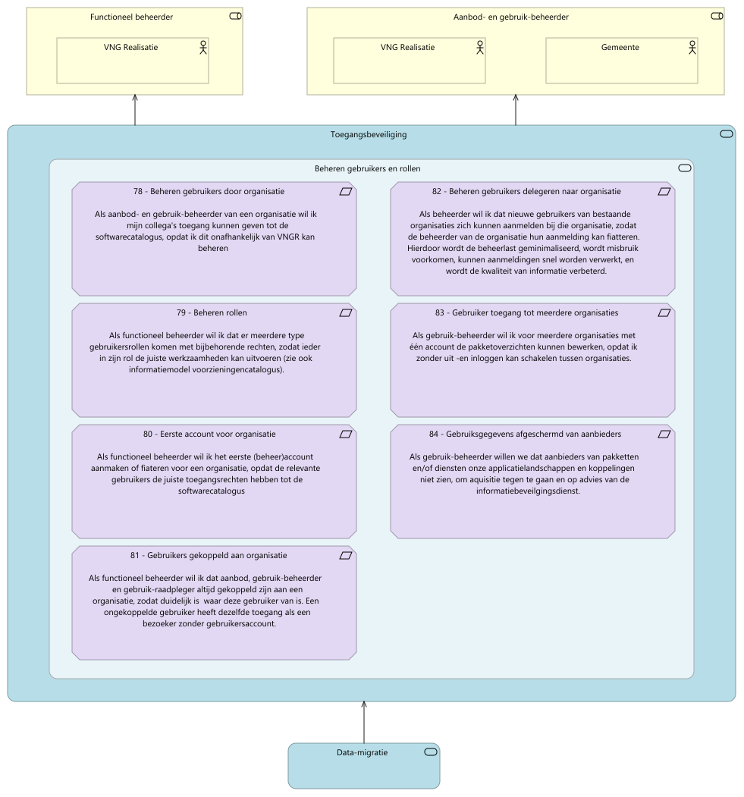
  <figcaption><i>Toegangsbeveiliging</i></figcaption>
</figure>

<table>
  <thead>
    <tr>
      <th colspan="3" width="20%">Element</th>
      <th rowspan="2" width="80%">Documentation</th>
    </tr>
  </thead>
  <tbody>
    <tr><td></td><td></td><td></td><td></td></tr>
    <tr valign="top")>
      <td colspan="3">Functioneel beheerder</td>
      <td></td>
    </tr>
    <tr valign="top")>
      <td colspan="1"></td>
      <td colspan="2">VNG Realisatie</td>
      <td></td>
    </tr>
    <tr valign="top")>
      <td colspan="3">Aanbod- en gebruik-beheerder</td>
      <td></td>
    </tr>
    <tr valign="top")>
      <td colspan="1"></td>
      <td colspan="2">VNG Realisatie</td>
      <td></td>
    </tr>
    <tr valign="top")>
      <td colspan="1"></td>
      <td colspan="2">Gemeente</td>
      <td>
Een gemeente is een groep van woonkernen (dorpen, steden) met het bijbehorende gebied die samen worden bestuurd door een politiek apparaat.
</td>
    </tr>
    <tr valign="top")>
      <td colspan="3">Toegangsbeveiliging</td>
      <td></td>
    </tr>
    <tr valign="top")>
      <td colspan="1"></td>
      <td colspan="2">Beheren gebruikers en rollen</td>
      <td></td>
    </tr>
    <tr valign="top")>
      <td colspan="2"></td>
      <td colspan="1">Beheren gebruikers door organisatie</td>
      <td>
Als aanbod- en gebruik-beheerder van een organisatie wil ik mijn collega's toegang kunnen geven tot de softwarecatalogus, opdat ik dit onafhankelijk van VNGR kan beheren
</td>
    </tr>
    <tr valign="top")>
      <td colspan="2"></td>
      <td colspan="1">Beheren gebruikers delegeren naar organisatie</td>
      <td>
Als beheerder wil ik dat nieuwe gebruikers van bestaande organisaties zich kunnen aanmelden bij die organisatie, zodat de beheerder van de organisatie hun aanmelding kan fiatteren. Hierdoor wordt de beheerlast geminimaliseerd, wordt misbruik voorkomen, kunnen aanmeldingen snel worden verwerkt, en wordt de kwaliteit van informatie verbeterd.
</td>
    </tr>
    <tr valign="top")>
      <td colspan="2"></td>
      <td colspan="1">Beheren rollen</td>
      <td>
Als functioneel beheerder wil ik dat er meerdere type gebruikersrollen komen met bijbehorende rechten, zodat ieder in zijn rol de juiste werkzaamheden kan uitvoeren (zie ook informatiemodel voorzieningencatalogus).
</td>
    </tr>
    <tr valign="top")>
      <td colspan="2"></td>
      <td colspan="1">Gebruiker toegang tot meerdere organisaties</td>
      <td>
Als gebruik-beheerder wil ik voor meerdere organisaties met één account de pakketoverzichten kunnen bewerken, opdat ik zonder uit -en inloggen kan schakelen tussen organisaties.
</td>
    </tr>
    <tr valign="top")>
      <td colspan="2"></td>
      <td colspan="1">Eerste account voor organisatie</td>
      <td>
Als functioneel beheerder wil ik het eerste (beheer)account aanmaken of fiateren voor een organisatie, opdat de relevante gebruikers de juiste toegangsrechten hebben tot de softwarecatalogus
</td>
    </tr>
    <tr valign="top")>
      <td colspan="2"></td>
      <td colspan="1">Gebruiksgegevens afgeschermd van aanbieders</td>
      <td>
Als gebruik-beheerder willen we dat aanbieders van pakketten en/of diensten onze applicatielandschappen en koppelingen niet zien, om aquisitie tegen te gaan en op advies van de informatiebeveilgingsdienst.
</td>
    </tr>
    <tr valign="top")>
      <td colspan="2"></td>
      <td colspan="1">Gebruikers gekoppeld aan organisatie</td>
      <td>
Als functioneel beheerder wil ik dat aanbod, gebruik-beheerder en gebruik-raadpleger altijd gekoppeld zijn aan een organisatie, zodat duidelijk is  waar deze gebruiker van is. Een ongekoppelde gebruiker heeft dezelfde toegang als een bezoeker zonder gebruikersaccount.
</td>
    </tr>
    <tr valign="top")>
      <td colspan="3">Data-migratie</td>
      <td></td>
    </tr>
  </tbody>
</table>

### Gebruik

<figure align="center">
  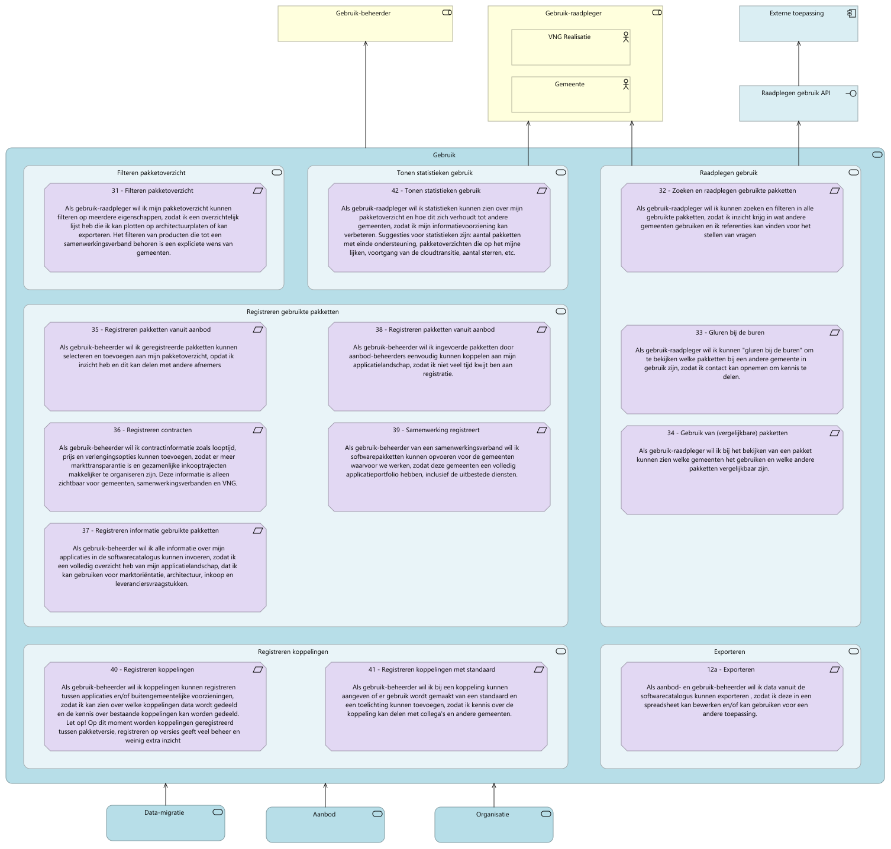
  <figcaption><i>Gebruik</i></figcaption>
</figure>

<table>
  <thead>
    <tr>
      <th colspan="3" width="20%">Element</th>
      <th rowspan="2" width="80%">Documentation</th>
    </tr>
  </thead>
  <tbody>
    <tr><td></td><td></td><td></td><td></td></tr>
    <tr valign="top")>
      <td colspan="3">Gebruik-beheerder</td>
      <td></td>
    </tr>
    <tr valign="top")>
      <td colspan="3">Gebruik-raadpleger</td>
      <td></td>
    </tr>
    <tr valign="top")>
      <td colspan="1"></td>
      <td colspan="2">VNG Realisatie</td>
      <td></td>
    </tr>
    <tr valign="top")>
      <td colspan="1"></td>
      <td colspan="2">Gemeente</td>
      <td>
Een gemeente is een groep van woonkernen (dorpen, steden) met het bijbehorende gebied die samen worden bestuurd door een politiek apparaat.
</td>
    </tr>
    <tr valign="top")>
      <td colspan="3">Externe toepassing</td>
      <td></td>
    </tr>
    <tr valign="top")>
      <td colspan="3">Raadplegen gebruik API</td>
      <td></td>
    </tr>
    <tr valign="top")>
      <td colspan="3">Gebruik</td>
      <td></td>
    </tr>
    <tr valign="top")>
      <td colspan="1"></td>
      <td colspan="2">Filteren pakketoverzicht</td>
      <td></td>
    </tr>
    <tr valign="top")>
      <td colspan="2"></td>
      <td colspan="1">Filteren pakketoverzicht</td>
      <td>
Als gebruik-raadpleger wil ik mijn pakketoverzicht kunnen filteren op meerdere eigenschappen, zodat ik een overzichtelijk lijst heb die ik kan plotten op architectuurplaten of kan exporteren. Het filteren van producten die tot een samenwerkingsverband behoren is een expliciete wens van gemeenten.
</td>
    </tr>
    <tr valign="top")>
      <td colspan="1"></td>
      <td colspan="2">Tonen statistieken gebruik</td>
      <td></td>
    </tr>
    <tr valign="top")>
      <td colspan="2"></td>
      <td colspan="1">Tonen statistieken gebruik</td>
      <td>
Als gebruik-raadpleger wil ik statistieken kunnen zien over mijn pakketoverzicht en hoe dit zich verhoudt tot andere gemeenten, zodat ik mijn informatievoorziening kan verbeteren. Suggesties voor statistieken zijn: aantal pakketten met einde ondersteuning, pakketoverzichten die op het mijne lijken, voortgang van de cloudtransitie, aantal sterren, etc.
</td>
    </tr>
    <tr valign="top")>
      <td colspan="1"></td>
      <td colspan="2">Registreren gebruikte pakketten</td>
      <td></td>
    </tr>
    <tr valign="top")>
      <td colspan="2"></td>
      <td colspan="1">Registreren pakketten vanuit aanbod</td>
      <td>
Als gebruik-beheerder wil ik geregistreerde pakketten kunnen selecteren en toevoegen aan mijn pakketoverzicht, opdat ik inzicht heb en dit kan delen met andere afnemers
</td>
    </tr>
    <tr valign="top")>
      <td colspan="2"></td>
      <td colspan="1">Registreren pakketten vanuit aanbod</td>
      <td>
Als gebruik-beheerder wil ik ingevoerde pakketten door aanbod-beheerders eenvoudig kunnen koppelen aan mijn applicatielandschap, zodat ik niet veel tijd kwijt ben aan registratie.
</td>
    </tr>
    <tr valign="top")>
      <td colspan="2"></td>
      <td colspan="1">Registreren contracten</td>
      <td>
Als gebruik-beheerder wil ik contractinformatie zoals looptijd, prijs en verlengingsopties kunnen toevoegen, zodat er meer markttransparantie is en gezamenlijke inkooptrajecten makkelijker te organiseren zijn. Deze informatie is alleen zichtbaar voor gemeenten, samenwerkingsverbanden en VNG.
</td>
    </tr>
    <tr valign="top")>
      <td colspan="2"></td>
      <td colspan="1">Samenwerking registreert</td>
      <td>
Als gebruik-beheerder van een samenwerkingsverband wil ik softwarepakketten kunnen opvoeren voor de gemeenten waarvoor we werken, zodat deze gemeenten een volledig applicatieportfolio hebben, inclusief de uitbestede diensten.
</td>
    </tr>
    <tr valign="top")>
      <td colspan="2"></td>
      <td colspan="1">Registreren informatie gebruikte pakketten</td>
      <td>
Als gebruik-beheerder wil ik alle informatie over mijn applicaties in de softwarecatalogus kunnen invoeren, zodat ik een volledig overzicht heb van mijn applicatielandschap, dat ik kan gebruiken voor marktoriëntatie, architectuur, inkoop en leveranciersvraagstukken.
</td>
    </tr>
    <tr valign="top")>
      <td colspan="1"></td>
      <td colspan="2">Raadplegen gebruik</td>
      <td></td>
    </tr>
    <tr valign="top")>
      <td colspan="2"></td>
      <td colspan="1">Zoeken en raadplegen gebruikte pakketten</td>
      <td>
Als gebruik-raadpleger wil ik kunnen zoeken en filteren in alle gebruikte pakketten, zodat ik inzicht krijg in wat andere gemeenten gebruiken en ik referenties kan vinden voor het stellen van vragen
</td>
    </tr>
    <tr valign="top")>
      <td colspan="2"></td>
      <td colspan="1">Gluren bij de buren</td>
      <td>
Als gebruik-raadpleger wil ik kunnen "gluren bij de buren" om te bekijken welke pakketten bij een andere gemeente in gebruik zijn, zodat ik contact kan opnemen om kennis te delen.
</td>
    </tr>
    <tr valign="top")>
      <td colspan="2"></td>
      <td colspan="1">Gebruik van (vergelijkbare) pakketten</td>
      <td>
Als gebruik-raadpleger wil ik bij het bekijken van een pakket kunnen zien welke gemeenten het gebruiken en welke andere pakketten vergelijkbaar zijn.
</td>
    </tr>
    <tr valign="top")>
      <td colspan="1"></td>
      <td colspan="2">Registreren koppelingen</td>
      <td></td>
    </tr>
    <tr valign="top")>
      <td colspan="2"></td>
      <td colspan="1">Registreren koppelingen</td>
      <td>
Als gebruik-beheerder wil ik koppelingen kunnen registreren tussen applicaties en/of buitengemeentelijke voorzieningen, zodat ik kan zien over welke koppelingen data wordt gedeeld en de kennis over bestaande koppelingen kan worden gedeeld. &nbsp;Let op! Op dit moment worden koppelingen geregistreerd tussen pakketversie, registreren op versies geeft veel beheer en weinig extra inzicht
</td>
    </tr>
    <tr valign="top")>
      <td colspan="2"></td>
      <td colspan="1">Registreren koppelingen met standaard</td>
      <td>
Als gebruik-beheerder wil ik bij een koppeling kunnen aangeven of er gebruik wordt gemaakt van een standaard en een toelichting kunnen toevoegen, zodat ik kennis over de koppeling kan delen met collega's en andere gemeenten.
</td>
    </tr>
    <tr valign="top")>
      <td colspan="1"></td>
      <td colspan="2">Exporteren</td>
      <td></td>
    </tr>
    <tr valign="top")>
      <td colspan="2"></td>
      <td colspan="1">Exporteren</td>
      <td>
Als aanbod- en gebruik-beheerder wil ik data vanuit de softwarecatalogus kunnen exporteren , zodat ik deze in een spreadsheet kan bewerken en/of kan gebruiken voor een andere toepassing.
</td>
    </tr>
    <tr valign="top")>
      <td colspan="3">Data-migratie</td>
      <td></td>
    </tr>
    <tr valign="top")>
      <td colspan="3">Aanbod</td>
      <td></td>
    </tr>
    <tr valign="top")>
      <td colspan="3">Organisatie</td>
      <td></td>
    </tr>
  </tbody>
</table>

### Beheren content en configuratie

<figure align="center">
  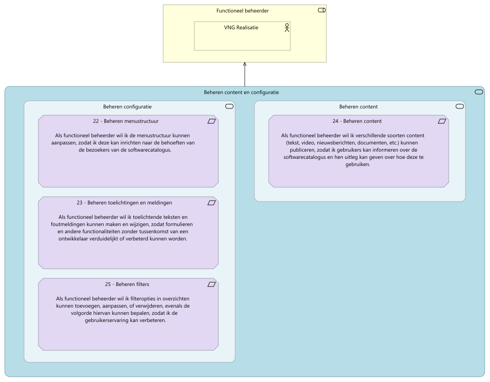
  <figcaption><i>Beheren content en configuratie</i></figcaption>
</figure>

<table>
  <thead>
    <tr>
      <th colspan="3" width="20%">Element</th>
      <th rowspan="2" width="80%">Documentation</th>
    </tr>
  </thead>
  <tbody>
    <tr><td></td><td></td><td></td><td></td></tr>
    <tr valign="top")>
      <td colspan="3">Functioneel beheerder</td>
      <td></td>
    </tr>
    <tr valign="top")>
      <td colspan="1"></td>
      <td colspan="2">VNG Realisatie</td>
      <td></td>
    </tr>
    <tr valign="top")>
      <td colspan="3">Beheren content en configuratie</td>
      <td></td>
    </tr>
    <tr valign="top")>
      <td colspan="1"></td>
      <td colspan="2">Beheren configuratie</td>
      <td></td>
    </tr>
    <tr valign="top")>
      <td colspan="2"></td>
      <td colspan="1">Beheren menustructuur</td>
      <td>
Als functioneel beheerder wil ik de menustructuur kunnen aanpassen, zodat ik deze kan inrichten naar de behoeften van de bezoekers van de softwarecatalogus.
</td>
    </tr>
    <tr valign="top")>
      <td colspan="2"></td>
      <td colspan="1">Beheren toelichtingen en meldingen</td>
      <td>
Als functioneel beheerder wil ik toelichtende teksten en foutmeldingen kunnen maken en wijzigen, zodat formulieren en andere functionaliteiten zonder tussenkomst van een ontwikkelaar verduidelijkt of verbeterd kunnen worden.
</td>
    </tr>
    <tr valign="top")>
      <td colspan="2"></td>
      <td colspan="1">Beheren filters</td>
      <td>
Als functioneel beheerder wil ik filteropties in overzichten kunnen toevoegen, aanpassen, of verwijderen, evenals de volgorde hiervan kunnen bepalen, zodat ik de gebruikerservaring kan verbeteren.
</td>
    </tr>
    <tr valign="top")>
      <td colspan="1"></td>
      <td colspan="2">Beheren content</td>
      <td></td>
    </tr>
    <tr valign="top")>
      <td colspan="2"></td>
      <td colspan="1">Beheren content</td>
      <td>
Als functioneel beheerder wil ik verschillende soorten content (tekst, video, nieuwsberichten, documenten, etc.) kunnen publiceren, zodat ik gebruikers kan informeren over de softwarecatalogus en hen uitleg kan geven over hoe deze te gebruiken.
</td>
    </tr>
  </tbody>
</table>

### Aanbod

<figure align="center">
  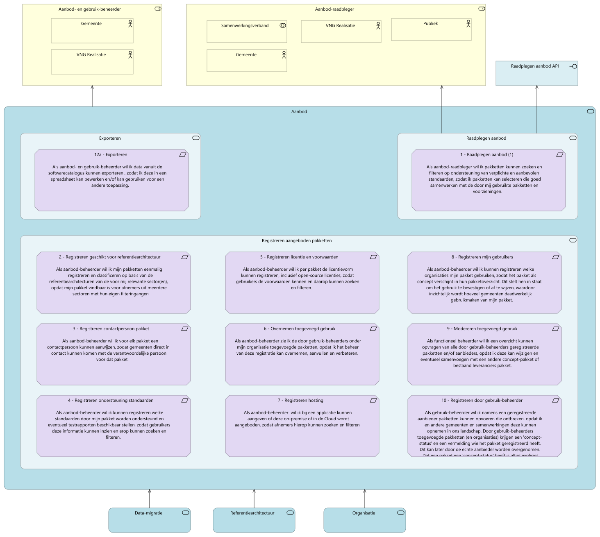
  <figcaption><i>Aanbod</i></figcaption>
</figure>

<table>
  <thead>
    <tr>
      <th colspan="3" width="20%">Element</th>
      <th rowspan="2" width="80%">Documentation</th>
    </tr>
  </thead>
  <tbody>
    <tr><td></td><td></td><td></td><td></td></tr>
    <tr valign="top")>
      <td colspan="3">Aanbod- en gebruik-beheerder</td>
      <td></td>
    </tr>
    <tr valign="top")>
      <td colspan="1"></td>
      <td colspan="2">Gemeente</td>
      <td>
Een gemeente is een groep van woonkernen (dorpen, steden) met het bijbehorende gebied die samen worden bestuurd door een politiek apparaat.
</td>
    </tr>
    <tr valign="top")>
      <td colspan="1"></td>
      <td colspan="2">VNG Realisatie</td>
      <td></td>
    </tr>
    <tr valign="top")>
      <td colspan="3">Aanbod-raadpleger</td>
      <td></td>
    </tr>
    <tr valign="top")>
      <td colspan="1"></td>
      <td colspan="2">Samenwerkingsverband</td>
      <td>
Een samenwerking (of samenwerkingverband) is een juridische vorm waarin gemeenten vastleggen welke specifiek omschreven taken en bevoegdheden aan de samenwerking worden gedelegeerd.
</td>
    </tr>
    <tr valign="top")>
      <td colspan="1"></td>
      <td colspan="2">VNG Realisatie</td>
      <td></td>
    </tr>
    <tr valign="top")>
      <td colspan="1"></td>
      <td colspan="2">Publiek</td>
      <td></td>
    </tr>
    <tr valign="top")>
      <td colspan="1"></td>
      <td colspan="2">Gemeente</td>
      <td>
Een gemeente is een groep van woonkernen (dorpen, steden) met het bijbehorende gebied die samen worden bestuurd door een politiek apparaat.
</td>
    </tr>
    <tr valign="top")>
      <td colspan="3">Raadplegen aanbod API</td>
      <td></td>
    </tr>
    <tr valign="top")>
      <td colspan="3">Aanbod</td>
      <td></td>
    </tr>
    <tr valign="top")>
      <td colspan="1"></td>
      <td colspan="2">Exporteren</td>
      <td></td>
    </tr>
    <tr valign="top")>
      <td colspan="2"></td>
      <td colspan="1">Exporteren</td>
      <td>
Als aanbod- en gebruik-beheerder wil ik data vanuit de softwarecatalogus kunnen exporteren , zodat ik deze in een spreadsheet kan bewerken en/of kan gebruiken voor een andere toepassing.
</td>
    </tr>
    <tr valign="top")>
      <td colspan="1"></td>
      <td colspan="2">Raadplegen aanbod</td>
      <td></td>
    </tr>
    <tr valign="top")>
      <td colspan="2"></td>
      <td colspan="1">Raadplegen aanbod (1)</td>
      <td>
Als aanbod-raadpleger wil ik pakketten kunnen zoeken en filteren op ondersteuning van verplichte en aanbevolen standaarden, zodat ik pakketten kan selecteren die goed samenwerken met de door mij gebruikte pakketten en voorzieningen.
</td>
    </tr>
    <tr valign="top")>
      <td colspan="1"></td>
      <td colspan="2">Registreren aangeboden pakketten</td>
      <td></td>
    </tr>
    <tr valign="top")>
      <td colspan="2"></td>
      <td colspan="1">Registreren geschikt voor referentiearchitectuur</td>
      <td>
Als aanbod-beheerder wil ik mijn pakketten eenmalig registreren en classificeren op basis van de referentiearchitecturen van de voor mij relevante sector(en), opdat mijn pakket vindbaar is voor afnemers uit meerdere sectoren met hun eigen filteringangen
</td>
    </tr>
    <tr valign="top")>
      <td colspan="2"></td>
      <td colspan="1">Registreren licentie en voorwaarden</td>
      <td>
Als aanbod-beheerder wil ik per pakket de licentievorm kunnen registreren, inclusief open-source licenties, zodat gebruikers de voorwaarden kennen en daarop kunnen zoeken en filteren.
</td>
    </tr>
    <tr valign="top")>
      <td colspan="2"></td>
      <td colspan="1">Registreren mijn gebruikers</td>
      <td>
Als aanbod-beheerder wil ik kunnen registreren welke organisaties mijn pakket gebruiken, zodat het pakket als concept verschijnt in hun pakketoverzicht. Dit stelt hen in staat om het gebruik te bevestigen of af te wijzen, waardoor inzichtelijk wordt hoeveel gemeenten daadwerkelijk gebruikmaken van mijn pakket.
</td>
    </tr>
    <tr valign="top")>
      <td colspan="2"></td>
      <td colspan="1">Registreren contactpersoon pakket</td>
      <td>
Als aanbod-beheerder wil ik voor elk pakket een contactpersoon kunnen aanwijzen, zodat gemeenten direct in contact kunnen komen met de verantwoordelijke persoon voor dat pakket.
</td>
    </tr>
    <tr valign="top")>
      <td colspan="2"></td>
      <td colspan="1">Overnemen toegevoegd gebruik</td>
      <td>
Als aanbod-beheerder zie ik de door gebruik-beheerders onder mijn organisatie toegevoegde pakketten, opdat ik het beheer van deze registratie kan overnemen, aanvullen en verbeteren.
</td>
    </tr>
    <tr valign="top")>
      <td colspan="2"></td>
      <td colspan="1">Modereren toegevoegd gebruik</td>
      <td>
Als functioneel beheerder wil ik een overzicht kunnen opvragen van alle door gebruik-beheerders geregistreerde pakketten en/of aanbieders, opdat ik deze kan wijzigen en eventueel samenvoegen met een andere concept-pakket of bestaand leveranciers pakket.
</td>
    </tr>
    <tr valign="top")>
      <td colspan="2"></td>
      <td colspan="1">Registreren ondersteuning standaarden</td>
      <td>
Als aanbod-beheerder wil ik kunnen registreren welke standaarden door mijn pakket worden ondersteund en eventueel testrapporten beschikbaar stellen, zodat gebruikers deze informatie kunnen inzien en erop kunnen zoeken en filteren.
</td>
    </tr>
    <tr valign="top")>
      <td colspan="2"></td>
      <td colspan="1">Registreren hosting</td>
      <td>
Als aanbod-beheerder  wil ik bij een applicatie kunnen aangeven of deze on-premise of in de Cloud wordt aangeboden, zodat afnemers hierop kunnen zoeken en filteren
</td>
    </tr>
    <tr valign="top")>
      <td colspan="2"></td>
      <td colspan="1">Registreren door gebruik-beheerder</td>
      <td>
Als gebruik-beheerder wil ik namens een geregistreerde aanbieder pakketten kunnen opvoeren die ontbreken, opdat ik en andere gemeenten en samenwerkingen deze kunnen opnemen in ons landschap. Door gebruik-beheerders toegevoegde pakketten (en organisaties) krijgen een 'concept-status' en een vermelding wie het pakket geregistreerd heeft. Dit kan later door de echte aanbieder worden overgenomen. Dat een pakket een 'concept-status' heeft is altijd expliciet zichtbaar.
</td>
    </tr>
    <tr valign="top")>
      <td colspan="3">Data-migratie</td>
      <td></td>
    </tr>
    <tr valign="top")>
      <td colspan="3">Referentiearchitectuur</td>
      <td></td>
    </tr>
    <tr valign="top")>
      <td colspan="3">Organisatie</td>
      <td></td>
    </tr>
  </tbody>
</table>

### Organisatie

<figure align="center">
  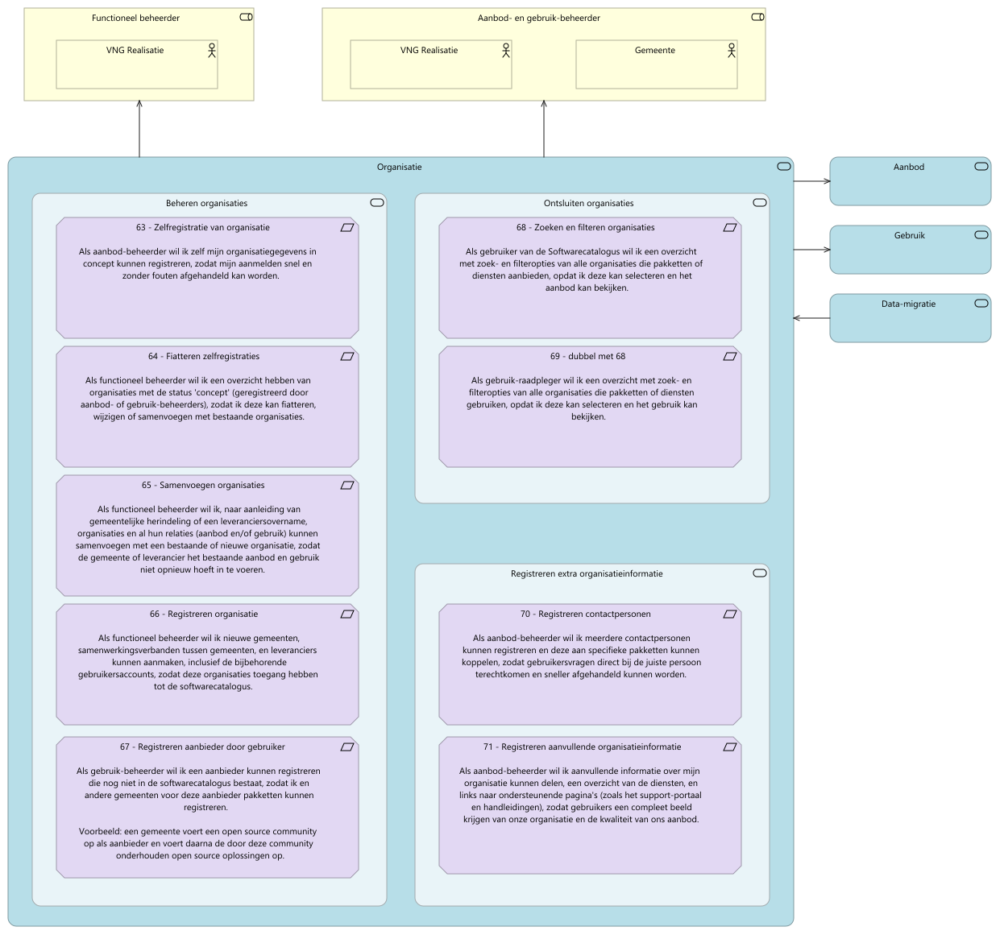
  <figcaption><i>Organisatie</i></figcaption>
</figure>

<table>
  <thead>
    <tr>
      <th colspan="3" width="20%">Element</th>
      <th rowspan="2" width="80%">Documentation</th>
    </tr>
  </thead>
  <tbody>
    <tr><td></td><td></td><td></td><td></td></tr>
    <tr valign="top")>
      <td colspan="3">Functioneel beheerder</td>
      <td></td>
    </tr>
    <tr valign="top")>
      <td colspan="1"></td>
      <td colspan="2">VNG Realisatie</td>
      <td></td>
    </tr>
    <tr valign="top")>
      <td colspan="3">Aanbod- en gebruik-beheerder</td>
      <td></td>
    </tr>
    <tr valign="top")>
      <td colspan="1"></td>
      <td colspan="2">VNG Realisatie</td>
      <td></td>
    </tr>
    <tr valign="top")>
      <td colspan="1"></td>
      <td colspan="2">Gemeente</td>
      <td>
Een gemeente is een groep van woonkernen (dorpen, steden) met het bijbehorende gebied die samen worden bestuurd door een politiek apparaat.
</td>
    </tr>
    <tr valign="top")>
      <td colspan="3">Organisatie</td>
      <td></td>
    </tr>
    <tr valign="top")>
      <td colspan="1"></td>
      <td colspan="2">Beheren organisaties</td>
      <td></td>
    </tr>
    <tr valign="top")>
      <td colspan="2"></td>
      <td colspan="1">Zelfregistratie van organisatie</td>
      <td>
Als aanbod-beheerder wil ik zelf mijn organisatiegegevens in concept kunnen registreren, zodat mijn aanmelden snel en zonder fouten afgehandeld kan worden.
</td>
    </tr>
    <tr valign="top")>
      <td colspan="2"></td>
      <td colspan="1">Fiatteren zelfregistraties</td>
      <td>
Als functioneel beheerder wil ik een overzicht hebben van organisaties met de status 'concept' (geregistreerd door aanbod- of gebruik-beheerders), zodat ik deze kan fiatteren, wijzigen of samenvoegen met bestaande organisaties.
</td>
    </tr>
    <tr valign="top")>
      <td colspan="2"></td>
      <td colspan="1">Samenvoegen organisaties</td>
      <td>
Als functioneel beheerder wil ik, naar aanleiding van gemeentelijke herindeling of een leveranciersovername, organisaties en al hun relaties (aanbod en/of gebruik) kunnen samenvoegen met een bestaande of nieuwe organisatie, zodat de gemeente of leverancier het bestaande aanbod en gebruik niet opnieuw hoeft in te voeren.
</td>
    </tr>
    <tr valign="top")>
      <td colspan="2"></td>
      <td colspan="1">Registreren organisatie</td>
      <td>
Als functioneel beheerder wil ik nieuwe gemeenten, samenwerkingsverbanden tussen gemeenten, en leveranciers kunnen aanmaken, inclusief de bijbehorende gebruikersaccounts, zodat deze organisaties toegang hebben tot de softwarecatalogus.
</td>
    </tr>
    <tr valign="top")>
      <td colspan="2"></td>
      <td colspan="1">Registreren aanbieder door gebruiker</td>
      <td>
Als gebruik-beheerder wil ik een aanbieder kunnen registreren die nog niet in de softwarecatalogus bestaat, zodat ik en andere gemeenten voor deze aanbieder pakketten kunnen registreren.

Voorbeeld: een gemeente voert een open source community op als aanbieder en voert daarna de door deze community onderhouden open source oplossingen op.
</td>
    </tr>
    <tr valign="top")>
      <td colspan="1"></td>
      <td colspan="2">Ontsluiten organisaties</td>
      <td></td>
    </tr>
    <tr valign="top")>
      <td colspan="2"></td>
      <td colspan="1">Zoeken en filteren organisaties</td>
      <td>
Als gebruiker van de Softwarecatalogus wil ik een overzicht met zoek- en filteropties van alle organisaties die pakketten of diensten aanbieden, opdat ik deze kan selecteren en het aanbod kan bekijken.
</td>
    </tr>
    <tr valign="top")>
      <td colspan="2"></td>
      <td colspan="1">dubbel met 68</td>
      <td>
Als gebruik-raadpleger wil ik een overzicht met zoek- en filteropties van alle organisaties die pakketten of diensten gebruiken, opdat ik deze kan selecteren en het gebruik kan bekijken.
</td>
    </tr>
    <tr valign="top")>
      <td colspan="1"></td>
      <td colspan="2">Registreren extra organisatieinformatie</td>
      <td></td>
    </tr>
    <tr valign="top")>
      <td colspan="2"></td>
      <td colspan="1">Registreren contactpersonen</td>
      <td>
Als aanbod-beheerder wil ik meerdere contactpersonen kunnen registreren en deze aan specifieke pakketten kunnen koppelen, zodat gebruikersvragen direct bij de juiste persoon terechtkomen en sneller afgehandeld kunnen worden.
</td>
    </tr>
    <tr valign="top")>
      <td colspan="2"></td>
      <td colspan="1">Registreren aanvullende organisatieinformatie</td>
      <td>
Als aanbod-beheerder wil ik aanvullende informatie over mijn organisatie kunnen delen, een overzicht van de diensten, en links naar ondersteunende pagina's (zoals het support-portaal en handleidingen), zodat gebruikers een compleet beeld krijgen van onze organisatie en de kwaliteit van ons aanbod.
</td>
    </tr>
    <tr valign="top")>
      <td colspan="3">Aanbod</td>
      <td></td>
    </tr>
    <tr valign="top")>
      <td colspan="3">Gebruik</td>
      <td></td>
    </tr>
    <tr valign="top")>
      <td colspan="3">Data-migratie</td>
      <td></td>
    </tr>
  </tbody>
</table>

### Referentiearchitectuur

<figure align="center">
  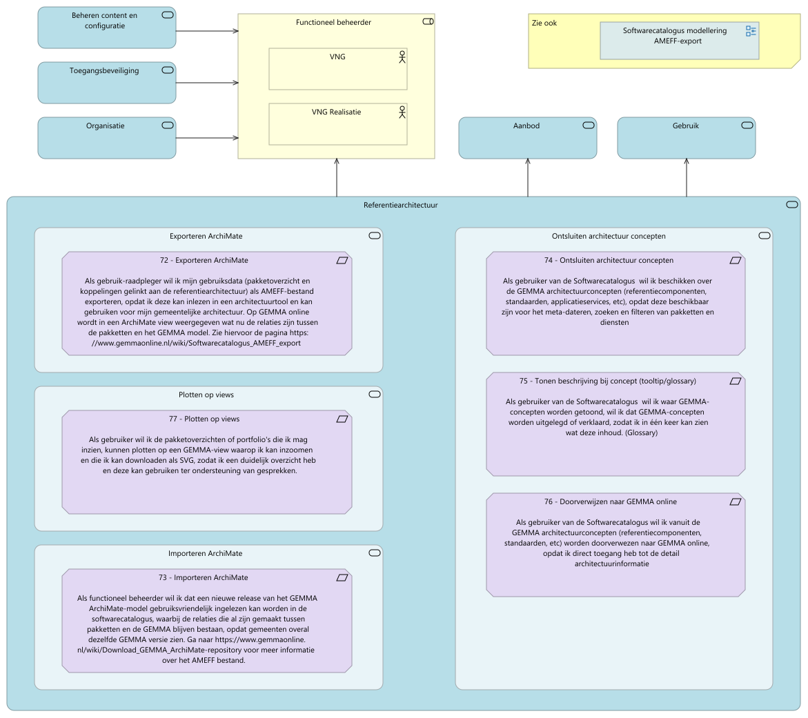
  <figcaption><i>Referentiearchitectuur</i></figcaption>
</figure>

<table>
  <thead>
    <tr>
      <th colspan="3" width="20%">Element</th>
      <th rowspan="2" width="80%">Documentation</th>
    </tr>
  </thead>
  <tbody>
    <tr><td></td><td></td><td></td><td></td></tr>
    <tr valign="top")>
      <td colspan="3">Beheren content en configuratie</td>
      <td></td>
    </tr>
    <tr valign="top")>
      <td colspan="3">Toegangsbeveiliging</td>
      <td></td>
    </tr>
    <tr valign="top")>
      <td colspan="3">Organisatie</td>
      <td></td>
    </tr>
    <tr valign="top")>
      <td colspan="3">Functioneel beheerder</td>
      <td></td>
    </tr>
    <tr valign="top")>
      <td colspan="1"></td>
      <td colspan="2">VNG</td>
      <td></td>
    </tr>
    <tr valign="top")>
      <td colspan="1"></td>
      <td colspan="2">VNG Realisatie</td>
      <td></td>
    </tr>
    <tr valign="top")>
      <td colspan="3">Aanbod</td>
      <td></td>
    </tr>
    <tr valign="top")>
      <td colspan="3">Gebruik</td>
      <td></td>
    </tr>
    <tr valign="top")>
      <td colspan="3">Referentiearchitectuur</td>
      <td></td>
    </tr>
    <tr valign="top")>
      <td colspan="1"></td>
      <td colspan="2">Exporteren ArchiMate</td>
      <td></td>
    </tr>
    <tr valign="top")>
      <td colspan="2"></td>
      <td colspan="1">Exporteren ArchiMate</td>
      <td>
Als gebruik-raadpleger wil ik mijn gebruiksdata (pakketoverzicht en koppelingen gelinkt aan de referentiearchitectuur) als AMEFF-bestand exporteren, opdat ik deze kan inlezen in een architectuurtool en kan gebruiken voor mijn gemeentelijke architectuur. Op GEMMA online wordt in een ArchiMate view weergegeven wat nu de relaties zijn tussen de pakketten en het GEMMA model. Zie hiervoor de pagina https://www.gemmaonline.nl/wiki/Softwarecatalogus<em>AMEFF</em>export
</td>
    </tr>
    <tr valign="top")>
      <td colspan="1"></td>
      <td colspan="2">Plotten op views</td>
      <td></td>
    </tr>
    <tr valign="top")>
      <td colspan="2"></td>
      <td colspan="1">Plotten op views</td>
      <td>
Als gebruiker wil ik de pakketoverzichten of portfolio's die ik mag inzien, kunnen plotten op een GEMMA-view waarop ik kan inzoomen en die ik kan downloaden als SVG, zodat ik een duidelijk overzicht heb en deze kan gebruiken ter ondersteuning van gesprekken.
</td>
    </tr>
    <tr valign="top")>
      <td colspan="1"></td>
      <td colspan="2">Importeren ArchiMate</td>
      <td></td>
    </tr>
    <tr valign="top")>
      <td colspan="2"></td>
      <td colspan="1">Importeren ArchiMate</td>
      <td>
Als functioneel beheerder wil ik dat een nieuwe release van het GEMMA ArchiMate-model gebruiksvriendelijk ingelezen kan worden in de softwarecatalogus, waarbij de relaties die al zijn gemaakt tussen pakketten en de GEMMA blijven bestaan, opdat gemeenten overal dezelfde GEMMA versie zien. Ga naar https://www.gemmaonline.nl/wiki/Download<em>GEMMA</em>ArchiMate-repository voor meer informatie over het AMEFF bestand.
</td>
    </tr>
    <tr valign="top")>
      <td colspan="1"></td>
      <td colspan="2">Ontsluiten architectuur concepten</td>
      <td></td>
    </tr>
    <tr valign="top")>
      <td colspan="2"></td>
      <td colspan="1">Ontsluiten architectuur concepten </td>
      <td>
Als gebruiker van de Softwarecatalogus  wil ik beschikken over de GEMMA architectuurconcepten (referentiecomponenten, standaarden, applicatieservices, etc), opdat deze beschikbaar zijn voor het meta-dateren, zoeken en filteren van pakketten en diensten
</td>
    </tr>
    <tr valign="top")>
      <td colspan="2"></td>
      <td colspan="1">Tonen beschrijving bij concept (tooltip/glossary)</td>
      <td>
Als gebruiker van de Softwarecatalogus  wil ik waar GEMMA-concepten worden getoond, wil ik dat GEMMA-concepten worden uitgelegd of verklaard, zodat ik in één keer kan zien wat deze inhoud. (Glossary)
</td>
    </tr>
    <tr valign="top")>
      <td colspan="2"></td>
      <td colspan="1">Doorverwijzen naar GEMMA online</td>
      <td>
Als gebruiker van de Softwarecatalogus wil ik vanuit de GEMMA architectuurconcepten (referentiecomponenten, standaarden, etc) worden doorverwezen naar GEMMA online, opdat ik direct toegang heb tot de detail architectuurinformatie
</td>
    </tr>
  </tbody>
</table>

### Management informatie

<figure align="center">
  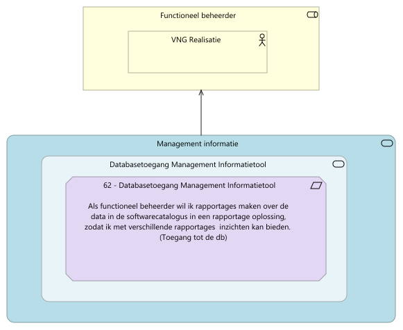
  <figcaption><i>Management informatie</i></figcaption>
</figure>

<table>
  <thead>
    <tr>
      <th colspan="3" width="20%">Element</th>
      <th rowspan="2" width="80%">Documentation</th>
    </tr>
  </thead>
  <tbody>
    <tr><td></td><td></td><td></td><td></td></tr>
    <tr valign="top")>
      <td colspan="3">Functioneel beheerder</td>
      <td></td>
    </tr>
    <tr valign="top")>
      <td colspan="1"></td>
      <td colspan="2">VNG Realisatie</td>
      <td></td>
    </tr>
    <tr valign="top")>
      <td colspan="3">Management informatie</td>
      <td></td>
    </tr>
    <tr valign="top")>
      <td colspan="1"></td>
      <td colspan="2">Databasetoegang Management Informatietool</td>
      <td></td>
    </tr>
    <tr valign="top")>
      <td colspan="2"></td>
      <td colspan="1">Databasetoegang Management Informatietool</td>
      <td>
Als functioneel beheerder wil ik rapportages maken over de data in de softwarecatalogus in een rapportage oplossing, zodat ik met verschillende rapportages  inzichten kan bieden. (Toegang tot de db)
</td>
    </tr>
  </tbody>
</table>

### Data-migratie

<figure align="center">
  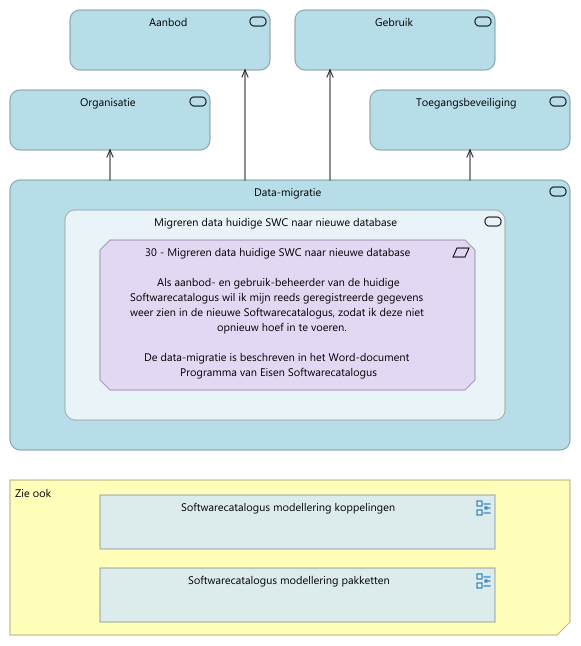
  <figcaption><i>Data-migratie</i></figcaption>
</figure>

<table>
  <thead>
    <tr>
      <th colspan="3" width="20%">Element</th>
      <th rowspan="2" width="80%">Documentation</th>
    </tr>
  </thead>
  <tbody>
    <tr><td></td><td></td><td></td><td></td></tr>
    <tr valign="top")>
      <td colspan="3">Aanbod</td>
      <td></td>
    </tr>
    <tr valign="top")>
      <td colspan="3">Gebruik</td>
      <td></td>
    </tr>
    <tr valign="top")>
      <td colspan="3">Organisatie</td>
      <td></td>
    </tr>
    <tr valign="top")>
      <td colspan="3">Toegangsbeveiliging</td>
      <td></td>
    </tr>
    <tr valign="top")>
      <td colspan="3">Data-migratie</td>
      <td></td>
    </tr>
    <tr valign="top")>
      <td colspan="1"></td>
      <td colspan="2">Migreren data huidige SWC naar nieuwe database</td>
      <td></td>
    </tr>
    <tr valign="top")>
      <td colspan="2"></td>
      <td colspan="1">Migreren data huidige SWC naar nieuwe database</td>
      <td>
Als aanbod- en gebruik-beheerder van de huidige Softwarecatalogus wil ik mijn reeds geregistreerde gegevens weer zien in de nieuwe Softwarecatalogus, zodat ik deze niet opnieuw hoef in te voeren.

De data-migratie is beschreven in het Word-document Programma van Eisen Softwarecatalogus
</td>
    </tr>
  </tbody>
</table>

### Softwarecatalogus Non-functionals

<figure align="center">
  
  <figcaption><i>Softwarecatalogus Non-functionals</i></figcaption>
</figure>

<table>
  <thead>
    <tr>
      <th colspan="3" width="20%">Element</th>
      <th rowspan="2" width="80%">Documentation</th>
    </tr>
  </thead>
  <tbody>
    <tr><td></td><td></td><td></td><td></td></tr>
    <tr valign="top")>
      <td colspan="3">Non-functional requirements</td>
      <td></td>
    </tr>
    <tr valign="top")>
      <td colspan="1"></td>
      <td colspan="2">Toegankelijkheid</td>
      <td></td>
    </tr>
    <tr valign="top")>
      <td colspan="2"></td>
      <td colspan="1">Feedback na fout</td>
      <td>
Als gebruiker wil ik op een juiste manier geïnformeerd worden door het systeem wanneer er een fout optreedt en wat de oorzaak hier van is, zodat ik op basis van deze informatie de juiste actie kan inzetten.
</td>
    </tr>
    <tr valign="top")>
      <td colspan="1"></td>
      <td colspan="2">Betrouwbaarheid</td>
      <td></td>
    </tr>
    <tr valign="top")>
      <td colspan="2"></td>
      <td colspan="1">Beheerorganisatie</td>
      <td>
De Leverancier borgt dat altijd binnen 2 kalenderdagen en tegen marktconforme tarieven expertise beschikbaar is voor ondersteuning bij onder meer het voorbereiden van een mogelijk wijzigingsverzoek
</td>
    </tr>
    <tr valign="top")>
      <td colspan="1"></td>
      <td colspan="2">Bruikbaarheid</td>
      <td></td>
    </tr>
    <tr valign="top")>
      <td colspan="2"></td>
      <td colspan="1">Gebruikersvriendelijk</td>
      <td>
De gebruikersinterface moet intuïtief en eenvoudig te gebruiken zijn, zodat gebruikers zonder uitgebreide training of technische kennis zelfstandig kunnen navigeren en taken uitvoeren. Het ontwerp moet consistent zijn met gangbare UX-principes, met duidelijke visuele feedback en logische workflows, en mag geen onnodige complexiteit bevatten. 

Voorkomen gebruikersfouten

<ul>
<li>De Softwarecatalogus valideert de invoer van metadata</li>
<li>Bij fouten worden aanwijzingen gegeven hoe de fout hersteld kan worden</li>
</ul></td>
    </tr>
    <tr valign="top")>
      <td colspan="2"></td>
      <td colspan="1">Toegankelijkheid</td>
      <td>
De softwarecatalogus voldoet aan de eisen van digitoegankelijk (https://www.digitoegankelijk.nl/)
</td>
    </tr>
    <tr valign="top")>
      <td colspan="1"></td>
      <td colspan="2">Werkwijze</td>
      <td></td>
    </tr>
    <tr valign="top")>
      <td colspan="2"></td>
      <td colspan="1">Testen</td>
      <td>
De opgeleverde software wordt door de ontwikkelpartij eerst getest volledig getest,  zodat bij oplevering alle (eerder) ontwikkelde functionaliteit werkt.
</td>
    </tr>
    <tr valign="top")>
      <td colspan="1"></td>
      <td colspan="2">Informatiemodel</td>
      <td></td>
    </tr>
    <tr valign="top")>
      <td colspan="2"></td>
      <td colspan="1">Gebruik informatiemodel voorzieningencatalogus</td>
      <td>
De Softwarecatalogus en de Softwarecatalogus API worden gebaseerd op het informatiemodel voorzieningencatalogus
</td>
    </tr>
    <tr valign="top")>
      <td colspan="1"></td>
      <td colspan="2">Informatiebeveiliging</td>
      <td></td>
    </tr>
    <tr valign="top")>
      <td colspan="2"></td>
      <td colspan="1">Logging activiteiten</td>
      <td>
Inschrijver borgt dat alle activiteiten, ook die van Eindgebruikers en Beheerders worden vastgelegd in audit-/ logbestanden. Dit zodanig beveiligd dat deze bestanden niet zomaar kunnen worden ingezien, gewijzigd of verwijderd door hiertoe niet bevoegd personeel

Inschrijver borgt dat een logregel minimaal het volgende bevat:

<ol>
<li>Waar mogelijk een tot een natuurlijke persoon herleidbare identificatie.</li>
<li>Waar mogelijk de identiteit van het werkstation of de locatie.</li>
<li>Het object waar de handeling op werd uitgevoerd.</li>
<li>Het resultaat van de handeling.</li>
<li>De gebeurtenis.</li>
<li>De datum en het tijdstip van de gebeurtenis.</li>
</ol></td>
    </tr>
    <tr valign="top")>
      <td colspan="2"></td>
      <td colspan="1">nl.internet standaarden</td>
      <td>
De site softwarecatalogus.nl gebruikt alle door https://nl.internet.nl/ geteste internetstandaarden op de juiste manier. In de nl.internet.nl websitetest scoort de domeinnaam Softwarecatalogus.nl 100%.
</td>
    </tr>
    <tr valign="top")>
      <td colspan="2"></td>
      <td colspan="1">Toegangsbeveiliging</td>
      <td>
Voor het beheren van gegevens hebben alleen geautoriseerde gebruikers toegang tot de Softwarecatalogus
Inloggen met 2 factor authenticatie

<ul>
<li>Een username, password (iets weten)</li>
<li>Een (TOTP) token, gegenereerd met een app op eigen telefoon of laptop (iets hebben)</li>
</ul>

Ondersteuning voor role based access control.

<ul>
<li>Beheerders krijgen toegang tot de beheerschermen op basis van een rol én een organisatie
Mogelijke rollen zijn bijvoorbeeld: Aanbod- en gebruik-beheerder, Ciso, …</li>
</ul></td>
    </tr>
    <tr valign="top")>
      <td colspan="1"></td>
      <td colspan="2">Overdraagbaarheid</td>
      <td></td>
    </tr>
    <tr valign="top")>
      <td colspan="2"></td>
      <td colspan="1">Aanpasbaarheid</td>
      <td>
Softwareplatform

<ul>
<li>De Softwarecatalogus wordt gerealiseerd met open source software componenten</li>
<li>De gebruikte ‘technologie stack’ bestaat uit gangbare componenten met een levendige community</li>
<li>Er wordt altijd gebruik gemaakt van door de community supported versies.</li>
</ul></td>
    </tr>
    <tr valign="top")>
      <td colspan="2"></td>
      <td colspan="1">OTAP omgeving</td>
      <td>
Voor de softwarecatalogus is een ontwikkel, test, acceptatie en productie-omgeving (OTAP) ingericht waarbij VNG en gemeenten toegang hebben tot de acceptatie en productieomgeving.
</td>
    </tr>
    <tr valign="top")>
      <td colspan="2"></td>
      <td colspan="1">Installeerbaarheid</td>
      <td>
Componenten zijn out-of-the-box geschikt voor installatie binnen een gestandaardiseerde (cloud-)infrastructuur platform (bijvoorbeeld Haven[1]). 

<ul>
<li>De componenten zijn geautomatiseerd te testen en deployen middels een CI/CD pipeline</li>
<li>Het doorlopen van de pipeline duurt max 1 uur</li>
<li>De voorziening dient als container op (bijvoorbeeld een kubernetes) infrastructuur te kunnen worden gedeployed</li>
</ul></td>
    </tr>
    <tr valign="top")>
      <td colspan="1"></td>
      <td colspan="2">Onderhoudbaarheid</td>
      <td></td>
    </tr>
    <tr valign="top")>
      <td colspan="2"></td>
      <td colspan="1">Herbruikbaarheid</td>
      <td>
Herbruikbaarheid

<ul>
<li>De broncode van (maatwerk)componenten is beschikbaar als open source software met een EUPL-licentie. </li>
<li>De broncode is goed gedocumenteerd</li>
<li>De broncode wordt beheerd in een git-repository van VNG Realisatie</li>
</ul></td>
    </tr>
    <tr valign="top")>
      <td colspan="2"></td>
      <td colspan="1">Techniek toekomstvast</td>
      <td>
De techniek (programmeertaal, packages, tooling) die gebruikt wordt voor de ontwikkeling van de nieuwe softwarecatalogus, is toekomstvast. Er zijn in Nederland minimaal 100  ontwikkelaars die deze tooling gebruikt en hier kennis van heeft
</td>
    </tr>
    <tr valign="top")>
      <td colspan="2"></td>
      <td colspan="1">Modulariteit</td>
      <td>
Proceslogica en bedrijfsregels zijn los van elkaar en los van de interactie naar gebruikers instelbaar.
</td>
    </tr>
    <tr valign="top")>
      <td colspan="2"></td>
      <td colspan="1">Webstatistieken</td>
      <td>
Als functioneel beheerder wil ik inzicht in het gebruik van de softwarecatalogus door middel van een open source en confrom privacy omgeving ingericht webstatistiekenpakket, zoals Matomo.
</td>
    </tr>
    <tr valign="top")>
      <td colspan="1"></td>
      <td colspan="2">Standaarden</td>
      <td></td>
    </tr>
    <tr valign="top")>
      <td colspan="2"></td>
      <td colspan="1">e-mail standaarden</td>
      <td>
De standaarden DKIM en DMARC zijn vereist voor het versturen van e-mails. Bijvoorbeeld voor het ondersteunen van het proces voor als je je wachtwoord bent vergeten

<ul>
<li>DKIM faciliteert van het vaststellen van organisatorische herkomst voor e-mail afkomstig van overheidsdomeinen, als deze over een onbeveiligde, publieke internetverbinding wordt verstuurd wanneer verdere authenticatie ontbreekt.</li>
</ul>

-&nbsp;DMARC is een standaard die het voor organisaties mogelijk maakt om te bepalen hoe e-mailproviders, omgaan met e-mail waarvan niet kan worden vastgesteld dat deze afkomstig is van het eigen domein. Hierdoor kunnen organisaties voorkomen dat anderen e-mails versturen namens het e-maildomein van de organisatie.
</td>
    </tr>
    <tr valign="top")>
      <td colspan="2"></td>
      <td colspan="1">NL API strategie standaarden</td>
      <td>
We ontwikkelen API-first in lijn met de NL API strategie en de recent gepubliceerde API standaarden bij het forum standaardisatie.

<ul>
<li>
Dit zijn de OpenAPI Specification (https://www.forumstandaardisatie.nl/open-standaarden/openapi-specification) en 
</li>
<li>
de REST-API Design Rules (https://www.forumstandaardisatie.nl/open-standaarden/rest-api-design-rules).
</li>
</ul></td>
    </tr>
  </tbody>
</table>

---

## Realisatie en onderhoud

### Softwarecatalogus gebruikers en eigenaren

Verdeling van eigenaarschap en verantwoordelijkheiden voor de Softwarecatalogus en gebruikte services
<figure align="center">
  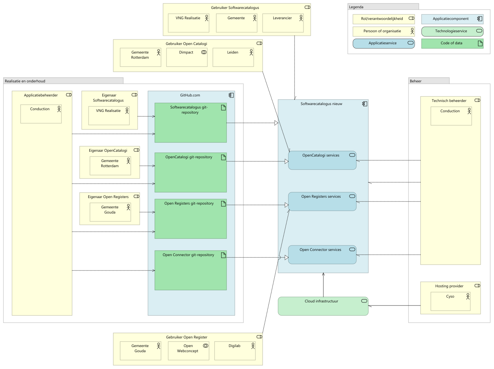
  <figcaption><i>Softwarecatalogus gebruikers en eigenaren</i></figcaption>
</figure>

<table>
  <thead>
    <tr>
      <th colspan="3" width="20%">Element</th>
      <th rowspan="2" width="80%">Documentation</th>
    </tr>
  </thead>
  <tbody>
    <tr><td></td><td></td><td></td><td></td></tr>
    <tr valign="top")>
      <td colspan="3">Gebruiker Softwarecatalogus</td>
      <td></td>
    </tr>
    <tr valign="top")>
      <td colspan="1"></td>
      <td colspan="2">VNG Realisatie</td>
      <td></td>
    </tr>
    <tr valign="top")>
      <td colspan="1"></td>
      <td colspan="2">Gemeente</td>
      <td>
Een gemeente is een groep van woonkernen (dorpen, steden) met het bijbehorende gebied die samen worden bestuurd door een politiek apparaat.
</td>
    </tr>
    <tr valign="top")>
      <td colspan="1"></td>
      <td colspan="2">Leverancier</td>
      <td>
Aanbieders van standaard-software(pakketten) voor gemeentelijke taken. Alleen leveranciers die het convenant met VNG/KING ondertekend hebben, mogen hun gegevens in de Softwarecatalogus zetten.
</td>
    </tr>
    <tr valign="top")>
      <td colspan="3">Gebruiker Open Catalogi</td>
      <td></td>
    </tr>
    <tr valign="top")>
      <td colspan="1"></td>
      <td colspan="2">Gemeente Rotterdam</td>
      <td></td>
    </tr>
    <tr valign="top")>
      <td colspan="1"></td>
      <td colspan="2">Dimpact</td>
      <td></td>
    </tr>
    <tr valign="top")>
      <td colspan="1"></td>
      <td colspan="2">Leiden</td>
      <td></td>
    </tr>
    <tr valign="top")>
      <td colspan="3">Realisatie en onderhoud</td>
      <td></td>
    </tr>
    <tr valign="top")>
      <td colspan="1"></td>
      <td colspan="2">Applicatiebeheerder</td>
      <td></td>
    </tr>
    <tr valign="top")>
      <td colspan="2"></td>
      <td colspan="1">Conduction</td>
      <td></td>
    </tr>
    <tr valign="top")>
      <td colspan="1"></td>
      <td colspan="2">Eigenaar Softwarecatalogus</td>
      <td></td>
    </tr>
    <tr valign="top")>
      <td colspan="2"></td>
      <td colspan="1">VNG Realisatie</td>
      <td></td>
    </tr>
    <tr valign="top")>
      <td colspan="1"></td>
      <td colspan="2">Eigenaar OpenCatalogi</td>
      <td></td>
    </tr>
    <tr valign="top")>
      <td colspan="2"></td>
      <td colspan="1">Gemeente Rotterdam</td>
      <td></td>
    </tr>
    <tr valign="top")>
      <td colspan="1"></td>
      <td colspan="2">Eigenaar Open Registers</td>
      <td></td>
    </tr>
    <tr valign="top")>
      <td colspan="2"></td>
      <td colspan="1">Gemeente Gouda</td>
      <td></td>
    </tr>
    <tr valign="top")>
      <td colspan="1"></td>
      <td colspan="2">GitHub.com</td>
      <td>
GitHub is een online platform voor softwareontwikkeling en versiebeheer (wikipedia)
</td>
    </tr>
    <tr valign="top")>
      <td colspan="2"></td>
      <td colspan="1">Softwarecatalogus git-repository</td>
      <td></td>
    </tr>
    <tr valign="top")>
      <td colspan="2"></td>
      <td colspan="1">OpenCatalogi git-repository</td>
      <td></td>
    </tr>
    <tr valign="top")>
      <td colspan="2"></td>
      <td colspan="1">Open Registers git-repository</td>
      <td></td>
    </tr>
    <tr valign="top")>
      <td colspan="2"></td>
      <td colspan="1">Open Connector git-repository</td>
      <td></td>
    </tr>
    <tr valign="top")>
      <td colspan="3">Softwarecatalogus nieuw</td>
      <td></td>
    </tr>
    <tr valign="top")>
      <td colspan="1"></td>
      <td colspan="2">OpenCatalogi services</td>
      <td></td>
    </tr>
    <tr valign="top")>
      <td colspan="1"></td>
      <td colspan="2">Open Registers services</td>
      <td>
Voor dataopslag wordt gebruik gemaakt van Open Registers, waardoor functioneel beheerders objecten zelfstandig kunnen toevoegen of aanpassen.
</td>
    </tr>
    <tr valign="top")>
      <td colspan="1"></td>
      <td colspan="2">Open Connector services</td>
      <td></td>
    </tr>
    <tr valign="top")>
      <td colspan="3">Cloud infrastructuur</td>
      <td></td>
    </tr>
    <tr valign="top")>
      <td colspan="3">Beheer</td>
      <td></td>
    </tr>
    <tr valign="top")>
      <td colspan="1"></td>
      <td colspan="2">Technisch beheerder</td>
      <td></td>
    </tr>
    <tr valign="top")>
      <td colspan="2"></td>
      <td colspan="1">Conduction</td>
      <td></td>
    </tr>
    <tr valign="top")>
      <td colspan="1"></td>
      <td colspan="2">Hosting provider</td>
      <td></td>
    </tr>
    <tr valign="top")>
      <td colspan="2"></td>
      <td colspan="1">Cyso</td>
      <td></td>
    </tr>
    <tr valign="top")>
      <td colspan="3">Gebruiker Open Register</td>
      <td></td>
    </tr>
    <tr valign="top")>
      <td colspan="1"></td>
      <td colspan="2">Gemeente Gouda</td>
      <td></td>
    </tr>
    <tr valign="top")>
      <td colspan="1"></td>
      <td colspan="2">Open Webconcept</td>
      <td></td>
    </tr>
    <tr valign="top")>
      <td colspan="1"></td>
      <td colspan="2">Digilab</td>
      <td></td>
    </tr>
  </tbody>
</table>

### Softwarecatalogus applicatiearchitectuur Referentiearchitectuur

Uitwerking van de realisatie van ArchiMate-functionaliteit in onderliggende services, componenten en functies
<figure align="center">
  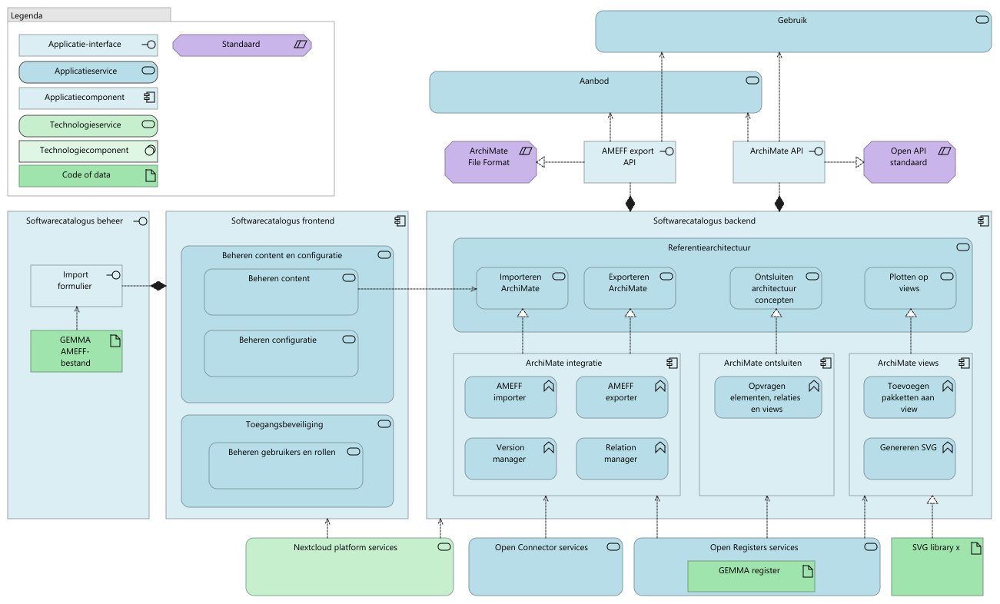
  <figcaption><i>Softwarecatalogus applicatiearchitectuur Referentiearchitectuur</i></figcaption>
</figure>

<table>
  <thead>
    <tr>
      <th colspan="3" width="20%">Element</th>
      <th rowspan="2" width="80%">Documentation</th>
    </tr>
  </thead>
  <tbody>
    <tr><td></td><td></td><td></td><td></td></tr>
    <tr valign="top")>
      <td colspan="3">Gebruik</td>
      <td></td>
    </tr>
    <tr valign="top")>
      <td colspan="3">Aanbod</td>
      <td></td>
    </tr>
    <tr valign="top")>
      <td colspan="3">ArchiMate File Format</td>
      <td>
Met het ArchiMate Bestandsuitwisselformaat kunnen architectuurtools ArchiMate architectuurmodellen met elkaar uitwisselen. Deze standaard wordt ook aangeduid als ArchiMate Model Exchange File Format (AMEFF)
</td>
    </tr>
    <tr valign="top")>
      <td colspan="3">AMEFF export API</td>
      <td></td>
    </tr>
    <tr valign="top")>
      <td colspan="3">ArchiMate API</td>
      <td></td>
    </tr>
    <tr valign="top")>
      <td colspan="3">Open API standaard</td>
      <td></td>
    </tr>
    <tr valign="top")>
      <td colspan="3">Softwarecatalogus beheer</td>
      <td></td>
    </tr>
    <tr valign="top")>
      <td colspan="1"></td>
      <td colspan="2">Import formulier</td>
      <td></td>
    </tr>
    <tr valign="top")>
      <td colspan="1"></td>
      <td colspan="2">GEMMA AMEFF-bestand</td>
      <td></td>
    </tr>
    <tr valign="top")>
      <td colspan="3">Softwarecatalogus frontend</td>
      <td></td>
    </tr>
    <tr valign="top")>
      <td colspan="1"></td>
      <td colspan="2">Beheren content en configuratie</td>
      <td></td>
    </tr>
    <tr valign="top")>
      <td colspan="2"></td>
      <td colspan="1">Beheren content</td>
      <td></td>
    </tr>
    <tr valign="top")>
      <td colspan="2"></td>
      <td colspan="1">Beheren configuratie</td>
      <td></td>
    </tr>
    <tr valign="top")>
      <td colspan="1"></td>
      <td colspan="2">Toegangsbeveiliging</td>
      <td></td>
    </tr>
    <tr valign="top")>
      <td colspan="2"></td>
      <td colspan="1">Beheren gebruikers en rollen</td>
      <td></td>
    </tr>
    <tr valign="top")>
      <td colspan="3">Softwarecatalogus backend</td>
      <td></td>
    </tr>
    <tr valign="top")>
      <td colspan="1"></td>
      <td colspan="2">ArchiMate integratie</td>
      <td></td>
    </tr>
    <tr valign="top")>
      <td colspan="2"></td>
      <td colspan="1">AMEFF importer</td>
      <td></td>
    </tr>
    <tr valign="top")>
      <td colspan="2"></td>
      <td colspan="1">AMEFF exporter</td>
      <td></td>
    </tr>
    <tr valign="top")>
      <td colspan="2"></td>
      <td colspan="1">Version manager</td>
      <td></td>
    </tr>
    <tr valign="top")>
      <td colspan="2"></td>
      <td colspan="1">Relation manager</td>
      <td></td>
    </tr>
    <tr valign="top")>
      <td colspan="3">Referentiearchitectuur</td>
      <td></td>
    </tr>
    <tr valign="top")>
      <td colspan="1"></td>
      <td colspan="2">Importeren ArchiMate</td>
      <td></td>
    </tr>
    <tr valign="top")>
      <td colspan="1"></td>
      <td colspan="2">Exporteren ArchiMate</td>
      <td></td>
    </tr>
    <tr valign="top")>
      <td colspan="1"></td>
      <td colspan="2">Ontsluiten architectuur concepten</td>
      <td></td>
    </tr>
    <tr valign="top")>
      <td colspan="1"></td>
      <td colspan="2">Plotten op views</td>
      <td></td>
    </tr>
    <tr valign="top")>
      <td colspan="3">ArchiMate ontsluiten</td>
      <td></td>
    </tr>
    <tr valign="top")>
      <td colspan="1"></td>
      <td colspan="2">Opvragen elementen, relaties en views</td>
      <td></td>
    </tr>
    <tr valign="top")>
      <td colspan="3">ArchiMate views</td>
      <td></td>
    </tr>
    <tr valign="top")>
      <td colspan="1"></td>
      <td colspan="2">Toevoegen pakketten aan view</td>
      <td></td>
    </tr>
    <tr valign="top")>
      <td colspan="1"></td>
      <td colspan="2">Genereren SVG</td>
      <td></td>
    </tr>
    <tr valign="top")>
      <td colspan="3">Nextcloud platform services</td>
      <td>
easy, unified access to files wherever they are stored
</td>
    </tr>
    <tr valign="top")>
      <td colspan="3">Open Connector services</td>
      <td></td>
    </tr>
    <tr valign="top")>
      <td colspan="3">Open Registers services</td>
      <td>
Voor dataopslag wordt gebruik gemaakt van Open Registers, waardoor functioneel beheerders objecten zelfstandig kunnen toevoegen of aanpassen.
</td>
    </tr>
    <tr valign="top")>
      <td colspan="1"></td>
      <td colspan="2">GEMMA register</td>
      <td></td>
    </tr>
    <tr valign="top")>
      <td colspan="3">SVG library x</td>
      <td></td>
    </tr>
  </tbody>
</table>

### Softwarecatalogus applicatiearchitectuur

Uitwerking van de realisatie van ArchiMate-functionaliteit in onderliggende services, componenten en functies
<figure align="center">
  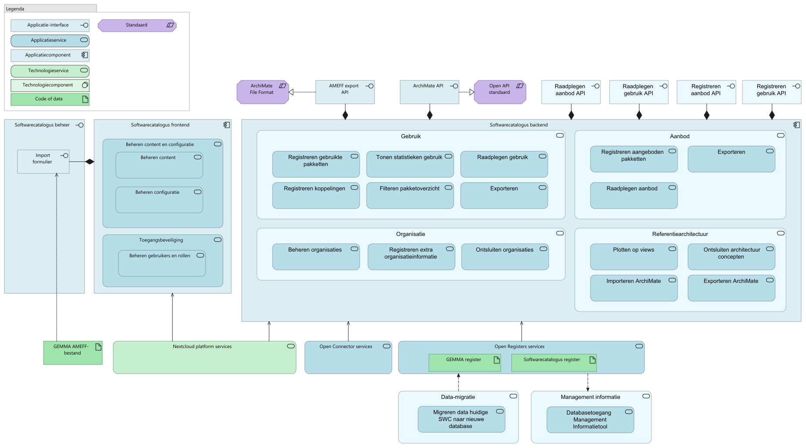
  <figcaption><i>Softwarecatalogus applicatiearchitectuur</i></figcaption>
</figure>

<table>
  <thead>
    <tr>
      <th colspan="3" width="20%">Element</th>
      <th rowspan="2" width="80%">Documentation</th>
    </tr>
  </thead>
  <tbody>
    <tr><td></td><td></td><td></td><td></td></tr>
    <tr valign="top")>
      <td colspan="3">ArchiMate File Format</td>
      <td>
Met het ArchiMate Bestandsuitwisselformaat kunnen architectuurtools ArchiMate architectuurmodellen met elkaar uitwisselen. Deze standaard wordt ook aangeduid als ArchiMate Model Exchange File Format (AMEFF)
</td>
    </tr>
    <tr valign="top")>
      <td colspan="3">AMEFF export API</td>
      <td></td>
    </tr>
    <tr valign="top")>
      <td colspan="3">ArchiMate API</td>
      <td></td>
    </tr>
    <tr valign="top")>
      <td colspan="3">Open API standaard</td>
      <td></td>
    </tr>
    <tr valign="top")>
      <td colspan="3">Raadplegen aanbod API</td>
      <td></td>
    </tr>
    <tr valign="top")>
      <td colspan="3">Raadplegen gebruik API</td>
      <td></td>
    </tr>
    <tr valign="top")>
      <td colspan="3">Registreren aanbod API</td>
      <td></td>
    </tr>
    <tr valign="top")>
      <td colspan="3">Registreren gebruik API</td>
      <td></td>
    </tr>
    <tr valign="top")>
      <td colspan="3">Softwarecatalogus beheer</td>
      <td></td>
    </tr>
    <tr valign="top")>
      <td colspan="1"></td>
      <td colspan="2">Import formulier</td>
      <td></td>
    </tr>
    <tr valign="top")>
      <td colspan="3">Softwarecatalogus frontend</td>
      <td></td>
    </tr>
    <tr valign="top")>
      <td colspan="1"></td>
      <td colspan="2">Beheren content en configuratie</td>
      <td></td>
    </tr>
    <tr valign="top")>
      <td colspan="2"></td>
      <td colspan="1">Beheren content</td>
      <td></td>
    </tr>
    <tr valign="top")>
      <td colspan="2"></td>
      <td colspan="1">Beheren configuratie</td>
      <td></td>
    </tr>
    <tr valign="top")>
      <td colspan="1"></td>
      <td colspan="2">Toegangsbeveiliging</td>
      <td></td>
    </tr>
    <tr valign="top")>
      <td colspan="2"></td>
      <td colspan="1">Beheren gebruikers en rollen</td>
      <td></td>
    </tr>
    <tr valign="top")>
      <td colspan="3">Softwarecatalogus backend</td>
      <td></td>
    </tr>
    <tr valign="top")>
      <td colspan="1"></td>
      <td colspan="2">Gebruik</td>
      <td></td>
    </tr>
    <tr valign="top")>
      <td colspan="2"></td>
      <td colspan="1">Registreren gebruikte pakketten</td>
      <td></td>
    </tr>
    <tr valign="top")>
      <td colspan="2"></td>
      <td colspan="1">Tonen statistieken gebruik</td>
      <td></td>
    </tr>
    <tr valign="top")>
      <td colspan="2"></td>
      <td colspan="1">Raadplegen gebruik</td>
      <td></td>
    </tr>
    <tr valign="top")>
      <td colspan="2"></td>
      <td colspan="1">Registreren koppelingen</td>
      <td></td>
    </tr>
    <tr valign="top")>
      <td colspan="2"></td>
      <td colspan="1">Filteren pakketoverzicht</td>
      <td></td>
    </tr>
    <tr valign="top")>
      <td colspan="2"></td>
      <td colspan="1">Exporteren</td>
      <td></td>
    </tr>
    <tr valign="top")>
      <td colspan="1"></td>
      <td colspan="2">Aanbod</td>
      <td></td>
    </tr>
    <tr valign="top")>
      <td colspan="2"></td>
      <td colspan="1">Registreren aangeboden pakketten</td>
      <td></td>
    </tr>
    <tr valign="top")>
      <td colspan="2"></td>
      <td colspan="1">Exporteren</td>
      <td></td>
    </tr>
    <tr valign="top")>
      <td colspan="2"></td>
      <td colspan="1">Raadplegen aanbod</td>
      <td></td>
    </tr>
    <tr valign="top")>
      <td colspan="1"></td>
      <td colspan="2">Organisatie</td>
      <td></td>
    </tr>
    <tr valign="top")>
      <td colspan="2"></td>
      <td colspan="1">Beheren organisaties</td>
      <td></td>
    </tr>
    <tr valign="top")>
      <td colspan="2"></td>
      <td colspan="1">Registreren extra organisatieinformatie</td>
      <td></td>
    </tr>
    <tr valign="top")>
      <td colspan="2"></td>
      <td colspan="1">Ontsluiten organisaties</td>
      <td></td>
    </tr>
    <tr valign="top")>
      <td colspan="1"></td>
      <td colspan="2">Referentiearchitectuur</td>
      <td></td>
    </tr>
    <tr valign="top")>
      <td colspan="2"></td>
      <td colspan="1">Plotten op views</td>
      <td></td>
    </tr>
    <tr valign="top")>
      <td colspan="2"></td>
      <td colspan="1">Ontsluiten architectuur concepten</td>
      <td></td>
    </tr>
    <tr valign="top")>
      <td colspan="2"></td>
      <td colspan="1">Importeren ArchiMate</td>
      <td></td>
    </tr>
    <tr valign="top")>
      <td colspan="2"></td>
      <td colspan="1">Exporteren ArchiMate</td>
      <td></td>
    </tr>
    <tr valign="top")>
      <td colspan="3">GEMMA AMEFF-bestand</td>
      <td></td>
    </tr>
    <tr valign="top")>
      <td colspan="3">Nextcloud platform services</td>
      <td>
easy, unified access to files wherever they are stored
</td>
    </tr>
    <tr valign="top")>
      <td colspan="3">Open Connector services</td>
      <td></td>
    </tr>
    <tr valign="top")>
      <td colspan="3">Open Registers services</td>
      <td>
Voor dataopslag wordt gebruik gemaakt van Open Registers, waardoor functioneel beheerders objecten zelfstandig kunnen toevoegen of aanpassen.
</td>
    </tr>
    <tr valign="top")>
      <td colspan="1"></td>
      <td colspan="2">GEMMA register</td>
      <td></td>
    </tr>
    <tr valign="top")>
      <td colspan="1"></td>
      <td colspan="2">Softwarecatalogus register</td>
      <td></td>
    </tr>
    <tr valign="top")>
      <td colspan="3">Data-migratie</td>
      <td></td>
    </tr>
    <tr valign="top")>
      <td colspan="1"></td>
      <td colspan="2">Migreren data huidige SWC naar nieuwe database</td>
      <td></td>
    </tr>
    <tr valign="top")>
      <td colspan="3">Management informatie</td>
      <td></td>
    </tr>
    <tr valign="top")>
      <td colspan="1"></td>
      <td colspan="2">Databasetoegang Management Informatietool</td>
      <td></td>
    </tr>
  </tbody>
</table>

### Softwarecatalogus technische architectuur

<figure align="center">
  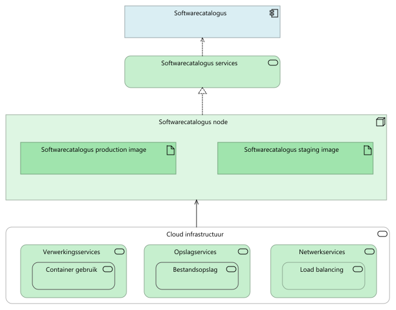
  <figcaption><i>Softwarecatalogus technische architectuur</i></figcaption>
</figure>

<table>
  <thead>
    <tr>
      <th colspan="3" width="20%">Element</th>
      <th rowspan="2" width="80%">Documentation</th>
    </tr>
  </thead>
  <tbody>
    <tr><td></td><td></td><td></td><td></td></tr>
    <tr valign="top")>
      <td colspan="3">Softwarecatalogus</td>
      <td>
De GEMMA Softwarecatalogus geeft een overzicht van applicaties en leveranciers die binnen Nederlandse gemeenten worden gebruikt, bedoeld om transparantie te bieden, samenwerking te stimuleren en standaardisatie binnen gemeentelijke IT te bevorderen.
</td>
    </tr>
    <tr valign="top")>
      <td colspan="3">Softwarecatalogus services</td>
      <td></td>
    </tr>
    <tr valign="top")>
      <td colspan="3">Softwarecatalogus node</td>
      <td></td>
    </tr>
    <tr valign="top")>
      <td colspan="1"></td>
      <td colspan="2">Softwarecatalogus production image</td>
      <td></td>
    </tr>
    <tr valign="top")>
      <td colspan="1"></td>
      <td colspan="2">Softwarecatalogus staging image</td>
      <td></td>
    </tr>
    <tr valign="top")>
      <td colspan="3">Cloud infrastructuur</td>
      <td></td>
    </tr>
    <tr valign="top")>
      <td colspan="1"></td>
      <td colspan="2">Verwerkingsservices</td>
      <td></td>
    </tr>
    <tr valign="top")>
      <td colspan="2"></td>
      <td colspan="1">Container gebruik</td>
      <td>
Technologieservice voor het gebruik van containers voor het isoleren en uitvoeren van applicaties in een consistente en reproduceerbare omgeving, onafhankelijk van de onderliggende infrastructuur.
</td>
    </tr>
    <tr valign="top")>
      <td colspan="1"></td>
      <td colspan="2">Opslagservices</td>
      <td></td>
    </tr>
    <tr valign="top")>
      <td colspan="2"></td>
      <td colspan="1">Bestandsopslag</td>
      <td>
Technologieservice voor het opslaan van digitale bestanden op fysieke of cloud-gebaseerde opslagmedia.
</td>
    </tr>
    <tr valign="top")>
      <td colspan="1"></td>
      <td colspan="2">Netwerkservices</td>
      <td></td>
    </tr>
    <tr valign="top")>
      <td colspan="2"></td>
      <td colspan="1">Load balancing</td>
      <td>
Technologieservice voor het verdelen van netwerk- of applicatieverkeer over meerdere servers om betrouwbaarheid en prestaties te optimaliseren.
</td>
    </tr>
  </tbody>
</table>

### Open Registers en -Connector technische architectuur

De services geleverd door Open Registers en Open Connector, en de onderliggende (Nextcloud) technologieservices
<figure align="center">
  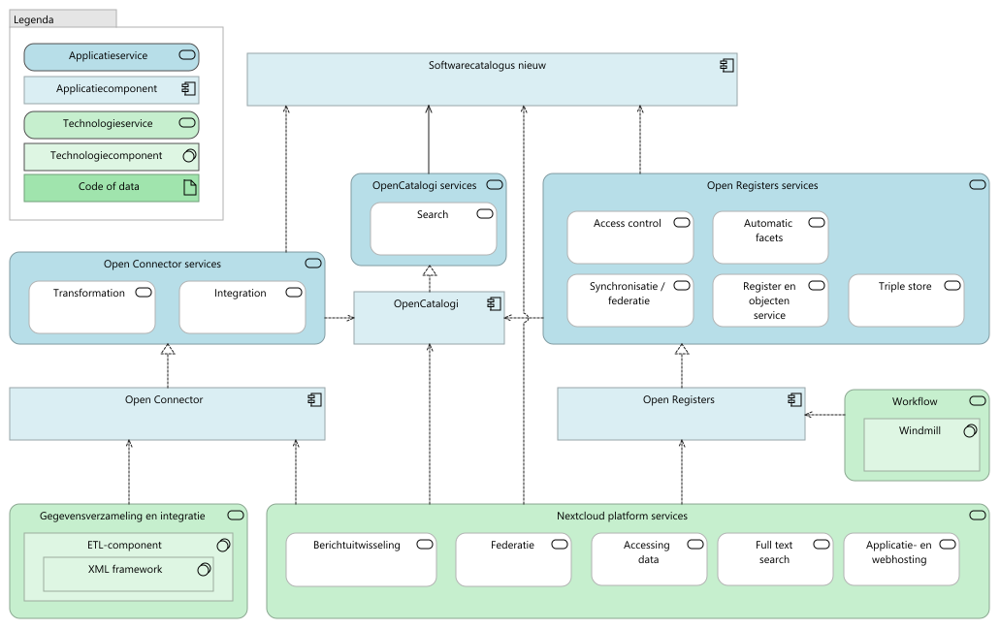
  <figcaption><i>Open Registers en -Connector technische architectuur</i></figcaption>
</figure>

<table>
  <thead>
    <tr>
      <th colspan="3" width="20%">Element</th>
      <th rowspan="2" width="80%">Documentation</th>
    </tr>
  </thead>
  <tbody>
    <tr><td></td><td></td><td></td><td></td></tr>
    <tr valign="top")>
      <td colspan="3">Softwarecatalogus nieuw</td>
      <td></td>
    </tr>
    <tr valign="top")>
      <td colspan="3">Open Connector services</td>
      <td></td>
    </tr>
    <tr valign="top")>
      <td colspan="1"></td>
      <td colspan="2">Transformation</td>
      <td></td>
    </tr>
    <tr valign="top")>
      <td colspan="1"></td>
      <td colspan="2">Integration</td>
      <td></td>
    </tr>
    <tr valign="top")>
      <td colspan="3">OpenCatalogi services</td>
      <td></td>
    </tr>
    <tr valign="top")>
      <td colspan="1"></td>
      <td colspan="2">Search</td>
      <td>
OpenCatalogi zorgt voor inzicht in zoekopdrachten en resultaten, waardoor functioneel beheerders controle hebben over zoekformulieren en datavoorziening aan eindgebruikers
</td>
    </tr>
    <tr valign="top")>
      <td colspan="3">OpenCatalogi</td>
      <td>
An open-source platform for managing and discovering software, data, and API catalogs, mainly for public sector organizations.  

Key Features:

<ul>
<li>Centralized registry of open data, APIs, and software components.  </li>
<li>Metadata-driven search and categorization.  </li>
<li>API integration for automated catalog updates.  </li>
<li>Supports linked data standards (RDF, SPARQL).</li>
</ul></td>
    </tr>
    <tr valign="top")>
      <td colspan="3">Open Registers services</td>
      <td>
Voor dataopslag wordt gebruik gemaakt van Open Registers, waardoor functioneel beheerders objecten zelfstandig kunnen toevoegen of aanpassen.
</td>
    </tr>
    <tr valign="top")>
      <td colspan="1"></td>
      <td colspan="2">Access control</td>
      <td></td>
    </tr>
    <tr valign="top")>
      <td colspan="1"></td>
      <td colspan="2">Automatic facets</td>
      <td>
Automatic Facets provide dynamic filtering options based on object properties and metadata.
</td>
    </tr>
    <tr valign="top")>
      <td colspan="1"></td>
      <td colspan="2">Synchronisatie / federatie</td>
      <td></td>
    </tr>
    <tr valign="top")>
      <td colspan="1"></td>
      <td colspan="2">Register en objecten service</td>
      <td>
Store and manage registers of objects within their Nextcloud instance
</td>
    </tr>
    <tr valign="top")>
      <td colspan="1"></td>
      <td colspan="2">Triple store</td>
      <td>
Een database service ontworpen voor het opslaan en opvragen van semantische gegevens in RDF-triples.
</td>
    </tr>
    <tr valign="top")>
      <td colspan="3">Open Connector</td>
      <td>
A middleware service that connects different data sources (APIs, databases, cloud storage) and transforms data into a standardized format for reuse. 
Provides gateway and service bus functionality like mapping, translation and synchronisation of data

Key Features:

<ul>
<li>Connects APIs, databases, and external registers.  </li>
<li>Converts and normalizes data into common formats (JSON, RDF, etc.).  </li>
<li>Automates data ingestion and synchronization.  </li>
<li>Supports workflow automation for seamless integration.</li>
</ul></td>
    </tr>
    <tr valign="top")>
      <td colspan="3">Open Registers</td>
      <td>
A Nextcloud-based app for managing structured, authoritative datasets (registers). It ensures versioned, trusted, and structured data storage, accessible via API and UI.

Key Features:

<ul>
<li>Store and manage registers in JSON, CSV, or XML format.</li>
<li>Version control and access permissions.</li>
<li>WebDAV &amp; API integration for external system access.</li>
<li>Federation support for syncing across Nextcloud instances.</li>
</ul></td>
    </tr>
    <tr valign="top")>
      <td colspan="3">Workflow</td>
      <td>
Workflow geïntegreerd met Open Registers maakt het mogelijk om extra business logic toe te voegen, zoals automatische e-mailmeldingen bij specifieke acties
</td>
    </tr>
    <tr valign="top")>
      <td colspan="1"></td>
      <td colspan="2">Windmill</td>
      <td>
Windmill is an open-source tool for automating workflows with scripts, APIs, and integrations.

It supports various programming languages, includes a low-code UI, and allows for scheduling, triggers, and event-driven automation
</td>
    </tr>
    <tr valign="top")>
      <td colspan="3">Gegevensverzameling en integratie</td>
      <td>
Technologieservice voor het verzamelen van gegevens uit verschillende bronnen en het integreren ervan in een samenhangend geheel voor analyse en gebruik.
</td>
    </tr>
    <tr valign="top")>
      <td colspan="1"></td>
      <td colspan="2">ETL-component</td>
      <td>
Technologiecomponent voor het extraheren, transformeren naar een gewenst formaat en laden in een doelopslagplaats gegevens uit verschillende bronnen. Bijvoorbeeld voor data warehousing.
</td>
    </tr>
    <tr valign="top")>
      <td colspan="2"></td>
      <td colspan="1">XML framework</td>
      <td>
Conduction transform - mapping service
</td>
    </tr>
    <tr valign="top")>
      <td colspan="3">Nextcloud platform services</td>
      <td>
easy, unified access to files wherever they are stored
</td>
    </tr>
    <tr valign="top")>
      <td colspan="1"></td>
      <td colspan="2">Berichtuitwisseling</td>
      <td>
Technologieservice voor het verzenden en ontvangen van berichten tussen systemen of applicaties.
</td>
    </tr>
    <tr valign="top")>
      <td colspan="1"></td>
      <td colspan="2">Federatie</td>
      <td></td>
    </tr>
    <tr valign="top")>
      <td colspan="1"></td>
      <td colspan="2">Accessing data</td>
      <td>
While Nextcloud provides a great deal of control over data access and sharing to administrators, users are presented with an easy to use and familiar interface through the web browser, Android and iOS apps and desktop sync applications. 
</td>
    </tr>
    <tr valign="top")>
      <td colspan="1"></td>
      <td colspan="2">Full text search</td>
      <td></td>
    </tr>
    <tr valign="top")>
      <td colspan="1"></td>
      <td colspan="2">Applicatie- en webhosting</td>
      <td>
Technologieservice voor het installeren en gebruiken van applicaties en websites.
</td>
    </tr>
  </tbody>
</table>

### DevOps en tools

<figure align="center">
  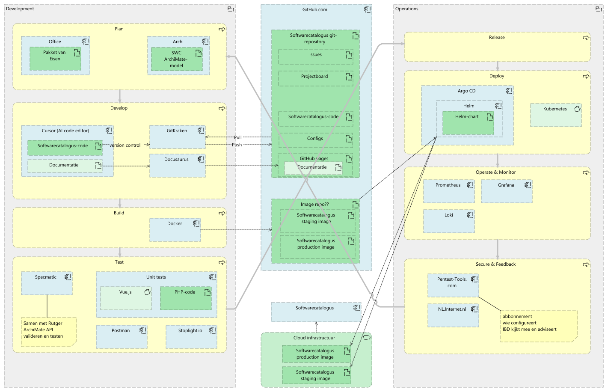
  <figcaption><i>DevOps en tools</i></figcaption>
</figure>

<table>
  <thead>
    <tr>
      <th colspan="5" width="20%">Element</th>
      <th rowspan="2" width="80%">Documentation</th>
    </tr>
  </thead>
  <tbody>
    <tr><td></td><td></td><td></td><td></td><td></td><td></td></tr>
    <tr valign="top")>
      <td colspan="5">Development</td>
      <td>
Het proces van ontwerpen, coderen, testen en implementeren van software, gericht op snelle en iteratieve levering van functionaliteit.
</td>
    </tr>
    <tr valign="top")>
      <td colspan="1"></td>
      <td colspan="4">Plan</td>
      <td>
Define requirements &amp; track work
</td>
    </tr>
    <tr valign="top")>
      <td colspan="2"></td>
      <td colspan="3">Office</td>
      <td>
Microsoft Office (Office 365 / Microsoft 365) is een productiviteitssuite met apps zoals Word, Excel, PowerPoint en Outlook, ontworpen voor documentbewerking, samenwerking en communicatie
</td>
    </tr>
    <tr valign="top")>
      <td colspan="3"></td>
      <td colspan="2">Pakket van Eisen</td>
      <td></td>
    </tr>
    <tr valign="top")>
      <td colspan="2"></td>
      <td colspan="3">Archi</td>
      <td>
Archi is een gratis en open-source ArchiMate-modelleringstool, ontworpen voor enterprise-architecten om architectuurmodellen te visualiseren, analyseren en beheren
</td>
    </tr>
    <tr valign="top")>
      <td colspan="3"></td>
      <td colspan="2">SWC ArchiMate-model</td>
      <td></td>
    </tr>
    <tr valign="top")>
      <td colspan="1"></td>
      <td colspan="4">Develop</td>
      <td>
Write, review, and version code
</td>
    </tr>
    <tr valign="top")>
      <td colspan="2"></td>
      <td colspan="3">Cursor (AI code editor)</td>
      <td>
Cursor AI is an AI-powered code editor built to simplify and accelerate software development. It is a fork of Visual Studio Code, bringing advanced AI capabilities to a familiar interface.
</td>
    </tr>
    <tr valign="top")>
      <td colspan="3"></td>
      <td colspan="2">Softwarecatalogus-code</td>
      <td></td>
    </tr>
    <tr valign="top")>
      <td colspan="3"></td>
      <td colspan="2">Documentatie</td>
      <td></td>
    </tr>
    <tr valign="top")>
      <td colspan="2"></td>
      <td colspan="3">GitKraken</td>
      <td>
GitKraken is een grafische Git-client die ontwikkeld is voor intuïtief versiebeheer, met functies zoals visuele commit-historie, ingebouwde GitFlow-ondersteuning, integraties met platforms zoals GitHub en GitLab, en samenwerkingstools voor teams.
</td>
    </tr>
    <tr valign="top")>
      <td colspan="2"></td>
      <td colspan="3">Docusaurus</td>
      <td>
Docusaurus is een open-source documentatieframework gebaseerd op Markdown en React, ontworpen voor het eenvoudig beheren en publiceren van technische documentatie, met features zoals automatische navigatie, versiebeheer, meertalige ondersteuning en eenvoudige hosting.
</td>
    </tr>
    <tr valign="top")>
      <td colspan="1"></td>
      <td colspan="4">Build</td>
      <td>
Automate software compilation
</td>
    </tr>
    <tr valign="top")>
      <td colspan="2"></td>
      <td colspan="3">Docker</td>
      <td>
Docker is a containerization platform that allows developers to package, distribute, and run applications in isolated environments, ensuring consistency, scalability, and efficiency across different environments.
</td>
    </tr>
    <tr valign="top")>
      <td colspan="1"></td>
      <td colspan="4">Test</td>
      <td>
Run automated tests
</td>
    </tr>
    <tr valign="top")>
      <td colspan="2"></td>
      <td colspan="3">Specmatic</td>
      <td>
Specmatic is an open-source tool for contract-driven testing, using API specifications as executable contracts to ensure compliance through automated tests and mocking.
</td>
    </tr>
    <tr valign="top")>
      <td colspan="2"></td>
      <td colspan="3">Unit tests</td>
      <td>
Voor het testen worden unit tests gebruikt, specifiek opgezet voor de backend in PHP en de frontend in Vue. Deze tests waarborgen de betrouwbaarheid van de kernfunctionaliteiten in beide lagen van de applicatie. 
</td>
    </tr>
    <tr valign="top")>
      <td colspan="3"></td>
      <td colspan="2">Vue.js</td>
      <td></td>
    </tr>
    <tr valign="top")>
      <td colspan="3"></td>
      <td colspan="2">PHP-code</td>
      <td>
PHP (Hypertext Preprocessor) is a widely used open-source scripting language designed for web development. It runs on the server side and is primarily used to generate dynamic web pages, interact with databases, and handle backend logic.
</td>
    </tr>
    <tr valign="top")>
      <td colspan="2"></td>
      <td colspan="3">Postman</td>
      <td>
Postman is een API-ontwikkelingsplatform waarmee ontwikkelaars API’s kunnen ontwerpen, testen en documenteren
</td>
    </tr>
    <tr valign="top")>
      <td colspan="2"></td>
      <td colspan="3">Stoplight.io</td>
      <td>
Stoplight is a collaborative API design platform that enables you to build excellent APIs and create scalable API programs
</td>
    </tr>
    <tr valign="top")>
      <td colspan="5">GitHub.com</td>
      <td>
GitHub is een online platform voor softwareontwikkeling en versiebeheer (wikipedia)
</td>
    </tr>
    <tr valign="top")>
      <td colspan="1"></td>
      <td colspan="4">Softwarecatalogus git-repository</td>
      <td></td>
    </tr>
    <tr valign="top")>
      <td colspan="2"></td>
      <td colspan="3">Issues</td>
      <td></td>
    </tr>
    <tr valign="top")>
      <td colspan="2"></td>
      <td colspan="3">Projectboard</td>
      <td></td>
    </tr>
    <tr valign="top")>
      <td colspan="2"></td>
      <td colspan="3">Softwarecatalogus-code</td>
      <td></td>
    </tr>
    <tr valign="top")>
      <td colspan="2"></td>
      <td colspan="3">Configs</td>
      <td></td>
    </tr>
    <tr valign="top")>
      <td colspan="2"></td>
      <td colspan="3">GitHub pages</td>
      <td></td>
    </tr>
    <tr valign="top")>
      <td colspan="3"></td>
      <td colspan="2">Documentatie</td>
      <td></td>
    </tr>
    <tr valign="top")>
      <td colspan="1"></td>
      <td colspan="4">Image repo??</td>
      <td></td>
    </tr>
    <tr valign="top")>
      <td colspan="2"></td>
      <td colspan="3">Softwarecatalogus staging image</td>
      <td></td>
    </tr>
    <tr valign="top")>
      <td colspan="2"></td>
      <td colspan="3">Softwarecatalogus production image</td>
      <td></td>
    </tr>
    <tr valign="top")>
      <td colspan="5">Softwarecatalogus</td>
      <td>
De GEMMA Softwarecatalogus geeft een overzicht van applicaties en leveranciers die binnen Nederlandse gemeenten worden gebruikt, bedoeld om transparantie te bieden, samenwerking te stimuleren en standaardisatie binnen gemeentelijke IT te bevorderen.
</td>
    </tr>
    <tr valign="top")>
      <td colspan="5">Cloud infrastructuur</td>
      <td></td>
    </tr>
    <tr valign="top")>
      <td colspan="1"></td>
      <td colspan="4">Softwarecatalogus production image</td>
      <td></td>
    </tr>
    <tr valign="top")>
      <td colspan="1"></td>
      <td colspan="4">Softwarecatalogus staging image</td>
      <td></td>
    </tr>
    <tr valign="top")>
      <td colspan="5">Operations</td>
      <td>
Het beheren en onderhouden van IT-infrastructuur, applicaties en services, met focus op stabiliteit, schaalbaarheid en betrouwbaarheid.
</td>
    </tr>
    <tr valign="top")>
      <td colspan="1"></td>
      <td colspan="4">Release</td>
      <td>
Deploy to staging/production
</td>
    </tr>
    <tr valign="top")>
      <td colspan="1"></td>
      <td colspan="4">Deploy</td>
      <td>
Continuously roll out updates
</td>
    </tr>
    <tr valign="top")>
      <td colspan="2"></td>
      <td colspan="3">Argo CD</td>
      <td>
Argo CD is a Kubernetes deployment tool that automatically synchronizes applications with their desired state defined in a Git repository, ensuring continuous and version-controlled delivery
</td>
    </tr>
    <tr valign="top")>
      <td colspan="3"></td>
      <td colspan="2">Helm</td>
      <td>
Helm is the package manager for Kubernetes and supports the process of defining, installing, and upgrading Kubernetes applications
</td>
    </tr>
    <tr valign="top")>
      <td colspan="4"></td>
      <td colspan="1">Helm-chart</td>
      <td>
A Helm chart is a package containing all the necessary files to define, configure, and deploy a Kubernetes application. It includes templates, default values, and metadata, allowing for reusable, versioned, and parameterized deployments.
</td>
    </tr>
    <tr valign="top")>
      <td colspan="2"></td>
      <td colspan="3">Kubernetes</td>
      <td></td>
    </tr>
    <tr valign="top")>
      <td colspan="1"></td>
      <td colspan="4">Operate & Monitor</td>
      <td>
Maintain and observe applications
</td>
    </tr>
    <tr valign="top")>
      <td colspan="2"></td>
      <td colspan="3">Prometheus</td>
      <td>
A monitoring and alerting toolkit designed for reliability and scalability, primarily used for collecting and querying time-series data
</td>
    </tr>
    <tr valign="top")>
      <td colspan="2"></td>
      <td colspan="3">Grafana</td>
      <td>
An open-source analytics and visualization tool that allows users to create interactive dashboards for monitoring and analyzing data from various sources
</td>
    </tr>
    <tr valign="top")>
      <td colspan="2"></td>
      <td colspan="3">Loki</td>
      <td>
A log aggregation system optimized for storing and querying logs efficiently, designed to work seamlessly with Grafana for log visualization
</td>
    </tr>
    <tr valign="top")>
      <td colspan="1"></td>
      <td colspan="4">Secure & Feedback</td>
      <td>
Ensure security &amp; learn from failures
Tools: Snyk, Trivy, OWASP ZAP
</td>
    </tr>
    <tr valign="top")>
      <td colspan="2"></td>
      <td colspan="3">Pentest-Tools.com </td>
      <td>
Pentest-Tools.com is een online platform voor penetratietesten, waarmee beveiligingsprofessionals websites, netwerken en systemen kunnen scannen op kwetsbaarheden

Pentest-Tools.com is a web-based platform that speeds-up the common steps performed in almost every assessment: reconnaissance, vulnerability scanning, exploitation, and report writing
</td>
    </tr>
    <tr valign="top")>
      <td colspan="2"></td>
      <td colspan="3">NL.Internet.nl</td>
      <td>
NL.Internet.nl is een online testtool ontwikkeld door het Internet Standards Platform om websites, e-mail en internetverbindingen te controleren op moderne internetstandaarden, zoals IPv6, DNSSEC, HTTPS en STARTTLS, met als doel de veiligheid en toekomstbestendigheid van het Nederlandse internet te verbeteren.
</td>
    </tr>
  </tbody>
</table>

